# Inter-Energy Retailer P2P Energy Trading 

## Scenario

P2P trading between prosumers belonging to different energy retailers. Each energy retailer and energy distribution utility handles routine activities: providing electricity connections, certifying meters, billing, maintaining grid infrastructure, and ensuring grid resilience within their jurisdiction.

**Example:** Prosumer P1 (Meter ID: M1, Retailer A) sells electricity to Prosumer P7 (Meter ID: M7, Retailer B).

---

## Present World Reality / Constraints[^1]

1. **Physical delivery is guaranteed by the grid.** Unlike other commodity exchanges, electrons flow based on physics. If P1 produces 10 kWh and P7 consumes 10 kWh on connected grids, energy "settles" physically regardless of any contract. The settlement problem is therefore purely financial: who owes whom, based on metered production and consumption.

2. **Energy Retailers face bill collection challenges.** Inter-energy retailer P2P trading must not worsen this problem.

3. **Fewer actors is better.** Requiring many systems or institutions to participate will slow market innovation and adoption.

---

## User Journey

### Model I - Direct Settlement and Contracting

*Energy distribution companies/Energy retailers provide infrastructure and have visibility but are not in the payment flow.*

---

## Actors

| # | Actor | Role |
|---|-------|------|
| 1 | **Energy retailers** | Consumer facing role |
| 2 | **Energy distribution companies** | Wire role / physical infra operator |
| 3 | **Buyer** | Energy consumer in P2P trade |
| 4 | **Seller** | Energy producer in P2P trade |
| 5 | **Trade platform(s)** | Consumer-facing applications that: |
|   |                     | - Allow prosumers to interact with the trade exchange |
|   |                     | - Handle user interfaces for trade placement and management (Energy retailer may also have a consumer interface) |
|   |                     | - Are a separate entity from the trade exchange itself |
| 6 | **Trade exchange(s)** | A logical entity (like NYSE/NSE/LSE in stock markets) that: |
|   |                       | - Runs the permissioned transaction ledger |
|   |                       | - Establishes relationships with Energy distribution companies/Energy retailers (and is trusted by them) |
|   |                       | - Provides regulatory backing and trust assurance |
|   |                       | - May be implemented using various technologies (blockchain, database, etc.) |

> **Assumption:** Whoever is running the permissioned ledger IS the trade exchange. This is a necessary logical construct. Whoever (regulators or other operators) runs this, that entity becomes the trade exchange.

---

## Overall Process Flow

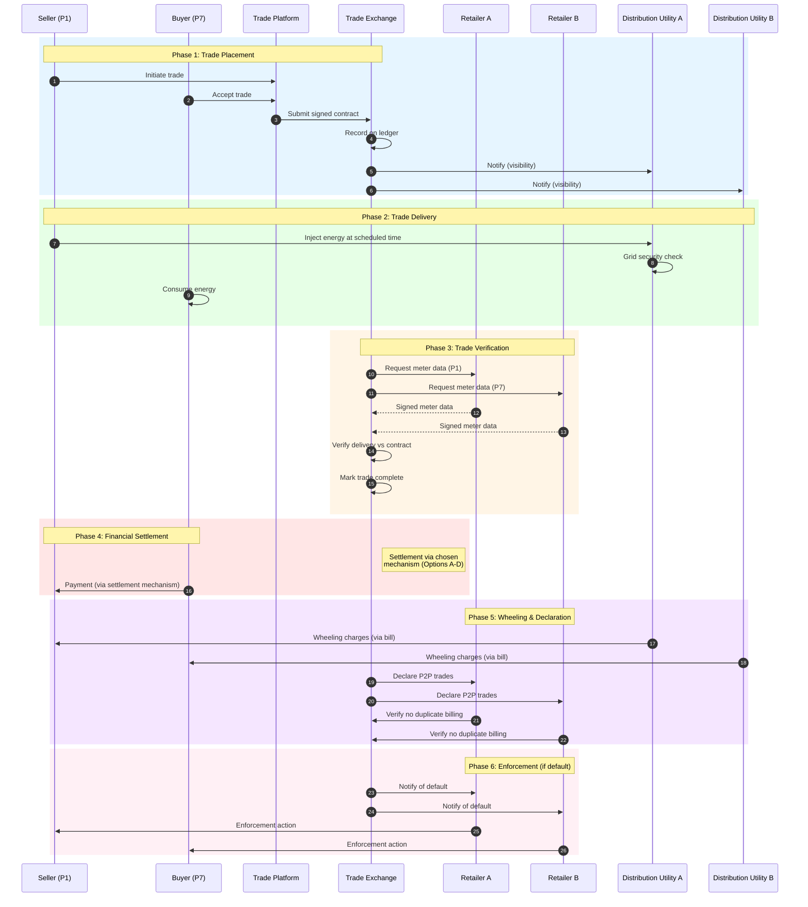

---

## Phase 1: Trade Placement

### 1. Trade Placement

- P1 (Energy Retailer A) logs into a trading app and initiates a trade with P7 (Energy Retailer B)
- Trade contract specifies: fulfillment terms (delivery window, energy quantity), agreed price, meter IDs for both parties, destination energy retailer details
- Contract is digitally signed by P1 and P7 using certificates issued by the trade exchange
- **Example:** P1-A agrees to deliver 5 kWh between 2–4 PM at USD 5/kWh to P7-B

> **Note:** As trading volumes grow, matching individual buyers to individual sellers might become impractical. A stock-exchange-style approach, where supply and demand are aggregated and matched algorithmically, may be more viable at scale.

### 2. Ledger Recording

- The trade is recorded on the trade exchange
- Energy distribution utilities gain visibility into scheduled trades for grid security management, capacity planning and financial reconciliation

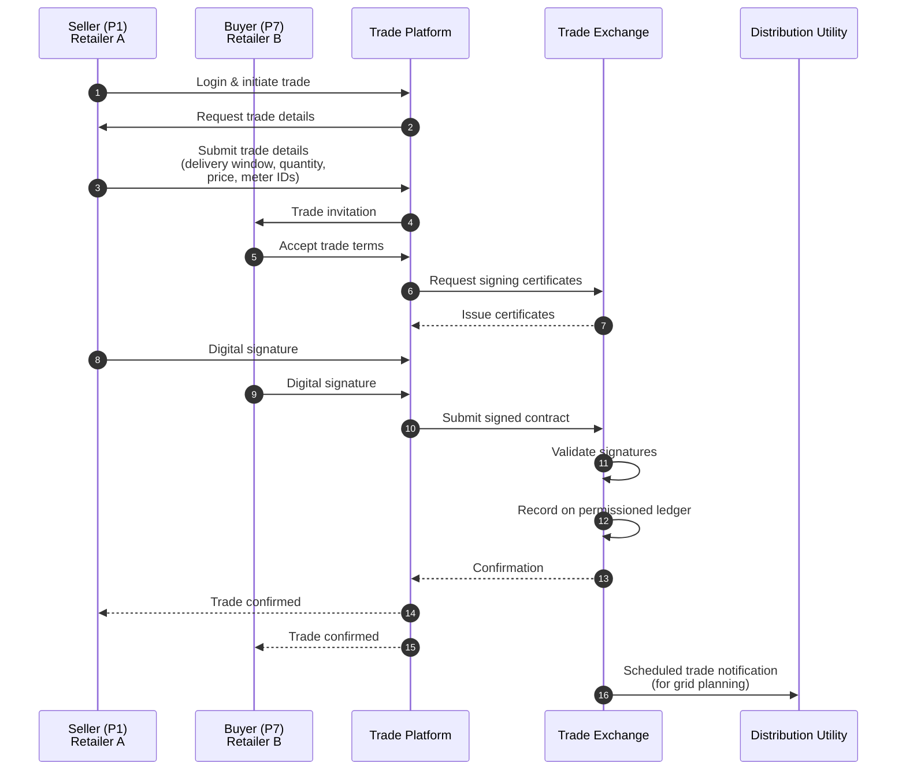

---

## Phase 2: Trade Delivery

*(Could be anywhere from a few hours to a few days later)*

### 3. Energy Injection

- At scheduled time, seller injects energy into the grid
- Corresponding energy distribution utility performs grid security checks and permits injection only if grid stability is maintained

### 4. Energy Consumption

- Buyer consumes energy as usual during the delivery window

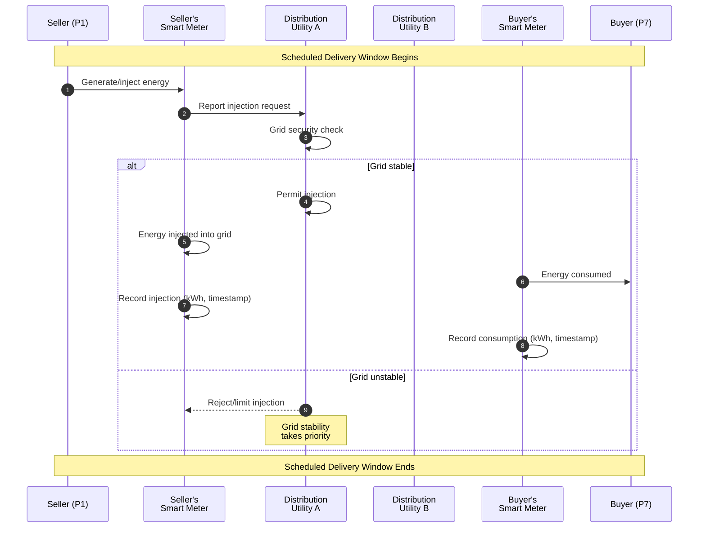

---

## Phase 3: Trade Verification

*(Will happen at a time gap from execution - verification frequency can be pre-determined, like every x hours)*

### 5. Trade Verification

- Trade exchange retrieves digitally signed meter data from both energy retailers
- Verifies delivery matches contract terms
- Marks trade as complete on the ledger

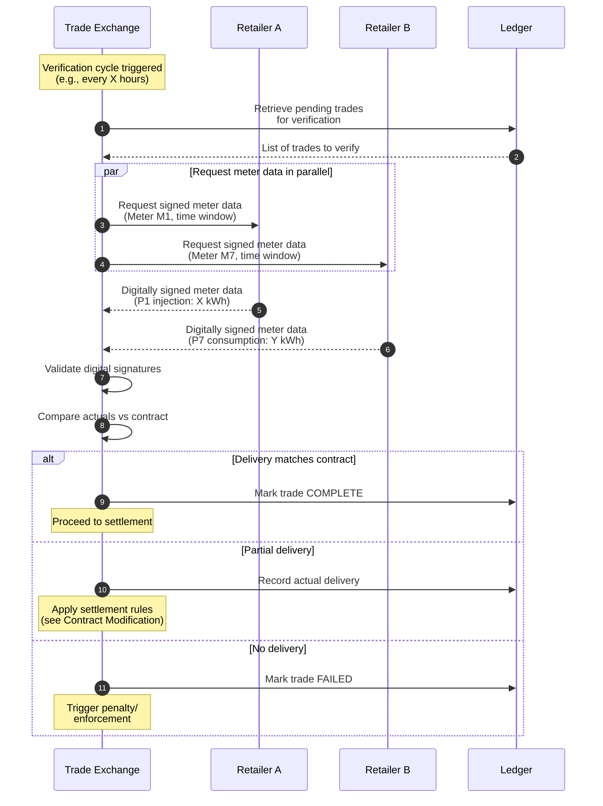

---

## Phase 4: Financial Settlement

### Settlement Options (Open for Group Discussion)

---

### Option A: Clearing House Model

- Central clearing house holds funds from the buyer (at the time of trade placement or at a later date for trades happening much later)
- Releases to seller upon delivery confirmation
- Similar to stock exchange settlement

| Pros | Cons |
|------|------|
| Familiar pattern, trusted intermediary, proven at scale | Requires new infrastructure; problematic for long-horizon trades (when does money go to the clearing house for a T+60 trade - day 1 or day 59?) |

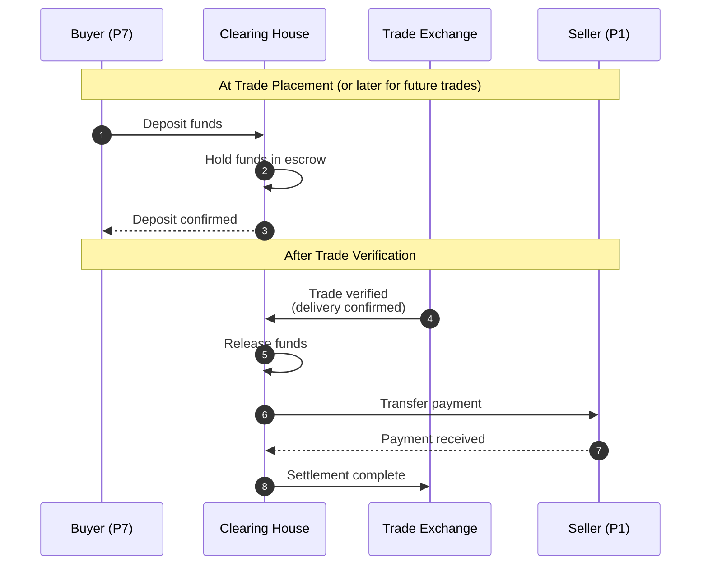

---

### Option B: Money Block / Escrow Model

- Funds blocked at trade placement
- Released on delivery confirmation
- Many payment rails like credit cards already support blocking

| Pros | Cons |
|------|------|
| Real-time assurance, works for immediate trades | Complex for future trades - how will we block money for 15, 30, 60 days? |

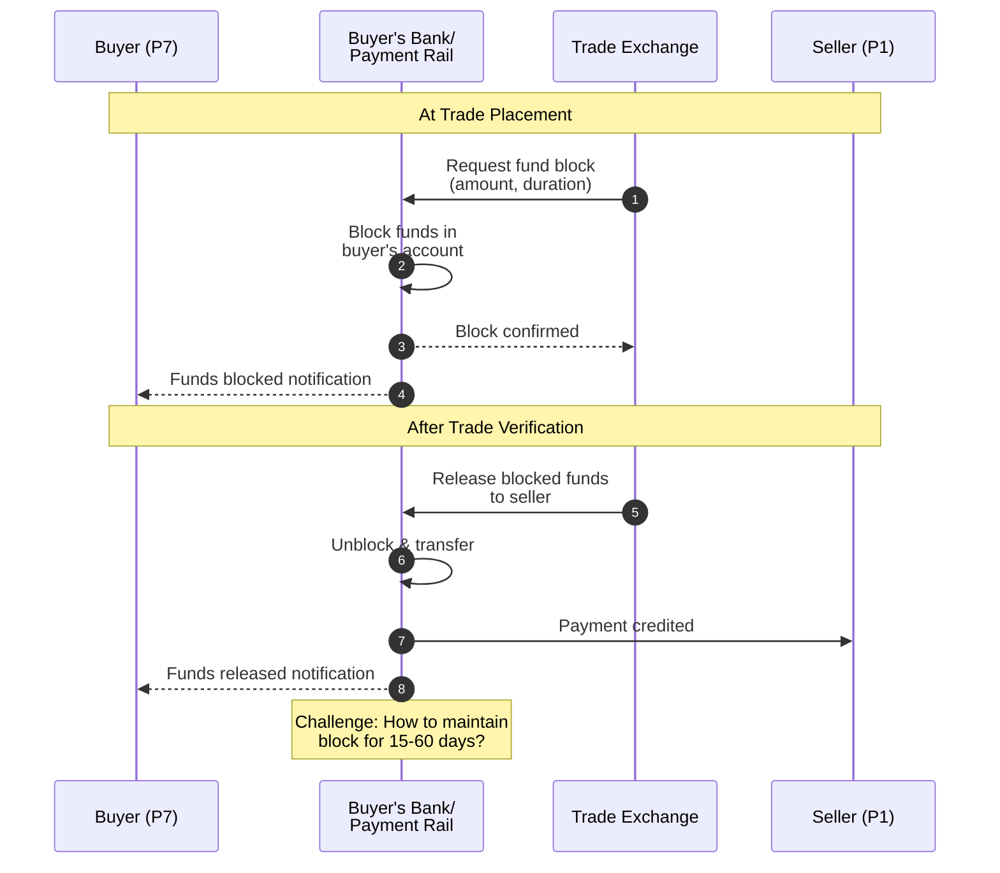

---

### Option C: Prepaid Model

- Every consumer/prosumer pre-pays their smart meter with x amount
- All purchases are directly addressed by respective retailers' bill collection and payments infra against the bill using the data from trade exchange

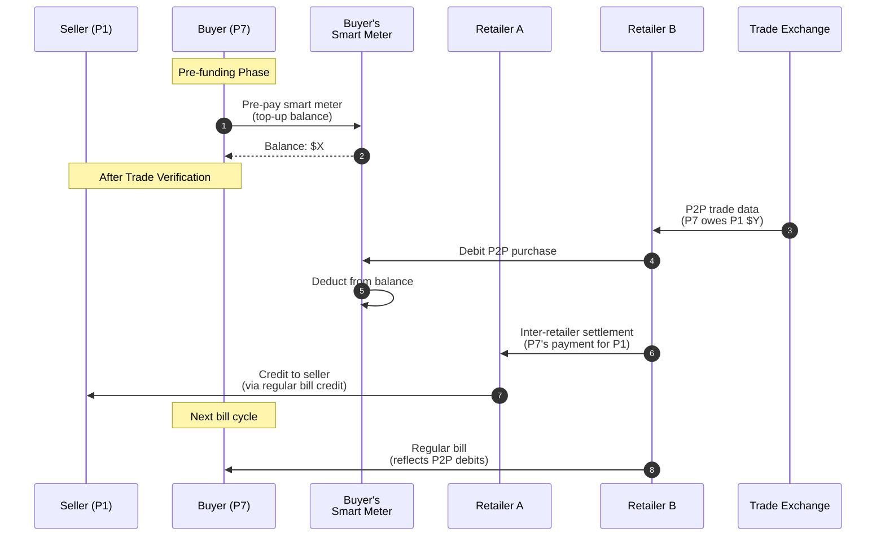

---

### Option D: Country Specific Bill Presentation Rails

**Example: BBPS in India**

Settlement via BBPS with either seller or seller's platform as registered biller.

---

#### Sub-option C1: Seller as Bill Presenter

- Seller (with platform support for KYC/registration) registers as biller on BBPS
- Trade verified → Seller raises invoice to buyer via BBPS
- Buyer pays within stipulated window
- Payment flows directly to seller
- If buyer defaults → Seller's discom notified → Buyer's discom notified for enforcement

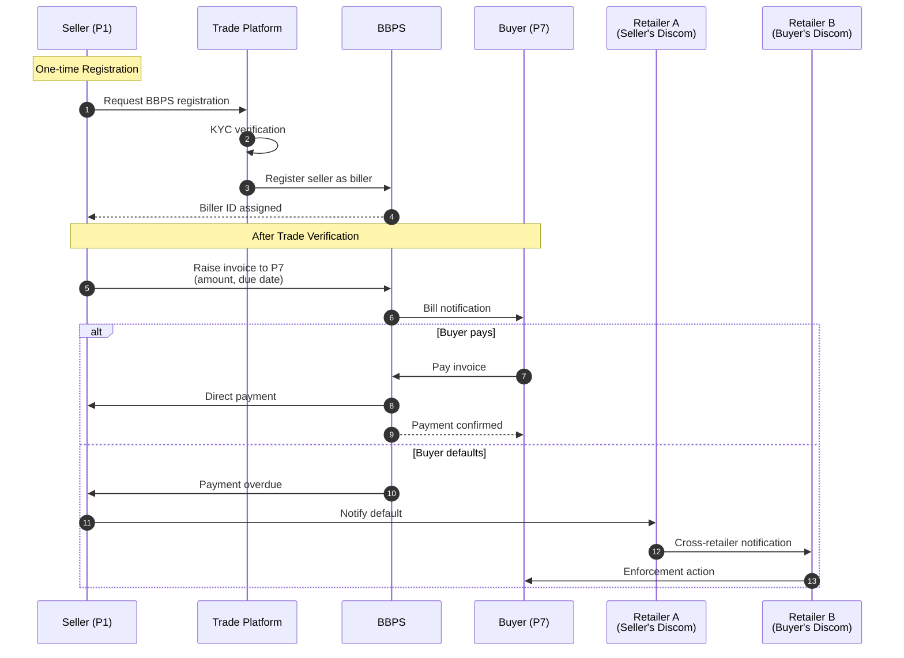

---

#### Sub-option C2: Platform as Bill Presenter

- Platform registers as BBPS biller
- Trade verified → Platform presents invoice to buyer
- Buyer pays via BBPS
- Platform credits seller (minus platform fee, if any)
- If buyer defaults → Platform notifies buyer's discom for enforcement

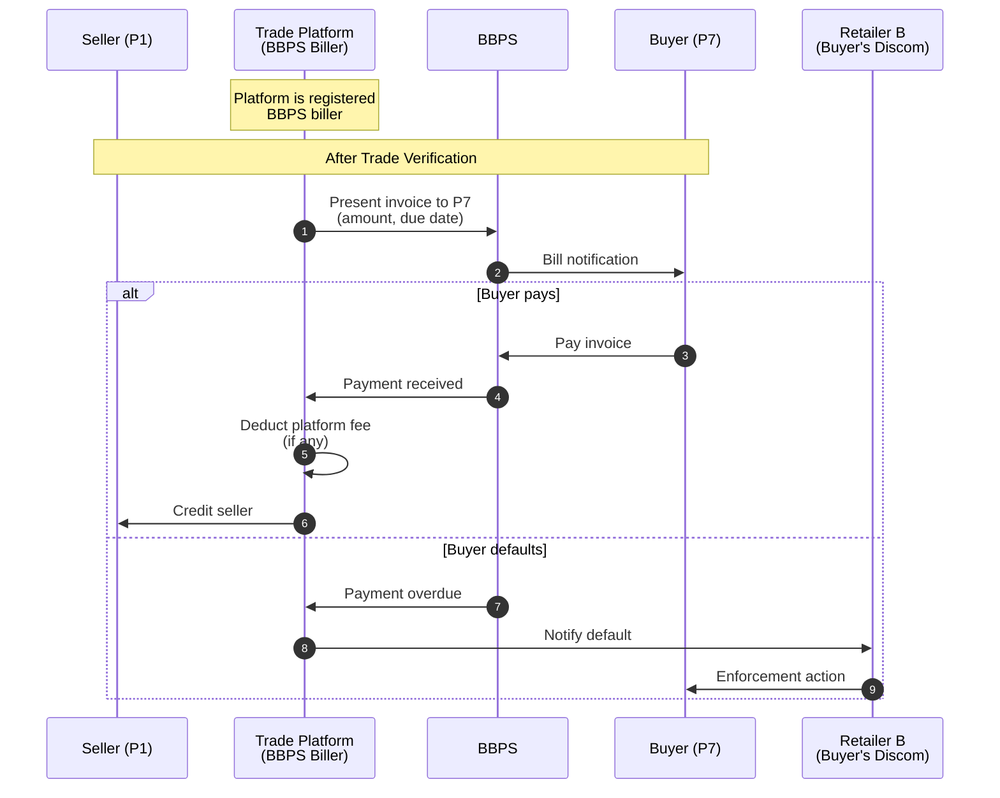

| Pros | Cons |
|------|------|
| Existing infrastructure, no new rails needed, familiar UX for consumers, handles small ticket sizes well, enforcement can piggyback on discom relationship | "Bill" framing may not fit P2P trade semantics, settlement timing tied to buyer action (not automatic), need to verify BBPS allows this use case |

---

## Phase 5: Wheeling Charges and Declaration

### Wheeling Charges

- Energy distributor utilities and Energy retailers charge wheeling fees for successful P2P trades
- Settled separately via prosumer's regular electricity bill

### Trade Declaration (Anti-Double-Dipping)

- **Buyer P2P trades** are declared to their energy retailer using trade exchange → avoids being billed twice for energy already purchased
- **Seller P2P trades** are declared to their energy retailer using trade exchange → prevents claiming payment from both P2P buyer and energy retailer for the same energy
- **Energy retailer verification:** Before charging any **prosumer-to-energy retailer or energy retailer-to-consumer energy sale**, energy retailer checks the ledger to confirm no P2P trade exists for the same meter ID(s) and time slot

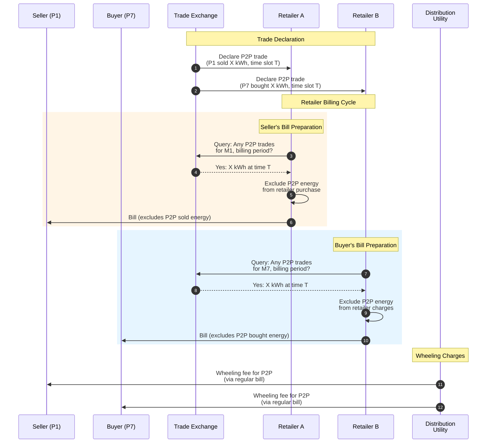

---

## Phase 6: Enforcement

*(Open for Group Discussion)*

When a prosumer registers for P2P trading, they sign an agreement consenting to energy retailer/distribution utility enforcement in case of payment default. Enforcement actions may include fines, suspension of P2P trading privileges or service disconnection in case of non-fulfilment.

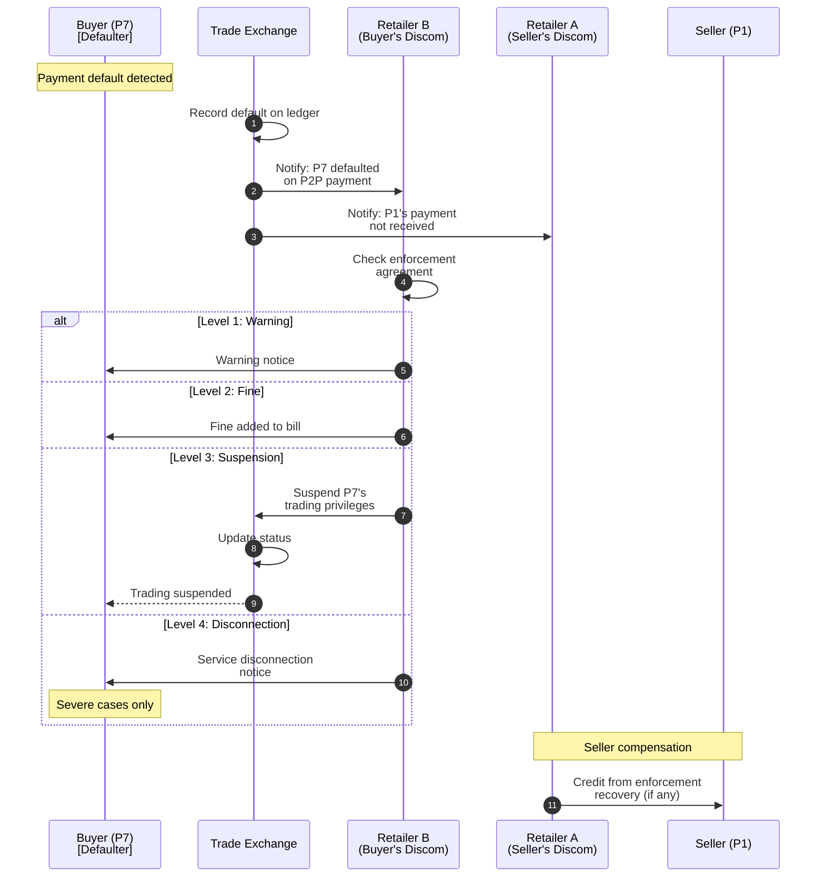

---

## Contract Modification and Partial Fulfillment

### Pre-delivery Modification

Either party can request changes (quantity, time, cancellation) via trading platform. The other party accepts/rejects. Trade exchange records modified contract with a small penalty to the requester. Energy retailers verify against modified contract.

### Settlement on Actuals

Regardless of contract, settlement = actual verified delivery × agreed price. Deviations handled as:

| Scenario | Settlement |
|----------|------------|
| **Seller under-delivers** | Buyer pays for actual; seller penalized |
| **Buyer under-consumes** | Open question: Pay for actual or contracted? |
| **Over-delivery/consumption** | Excess settles with respective energy retailer at standard rates |

**Example - Tolerance band:** Minor deviations (±10%?) settle at actuals without penalty.

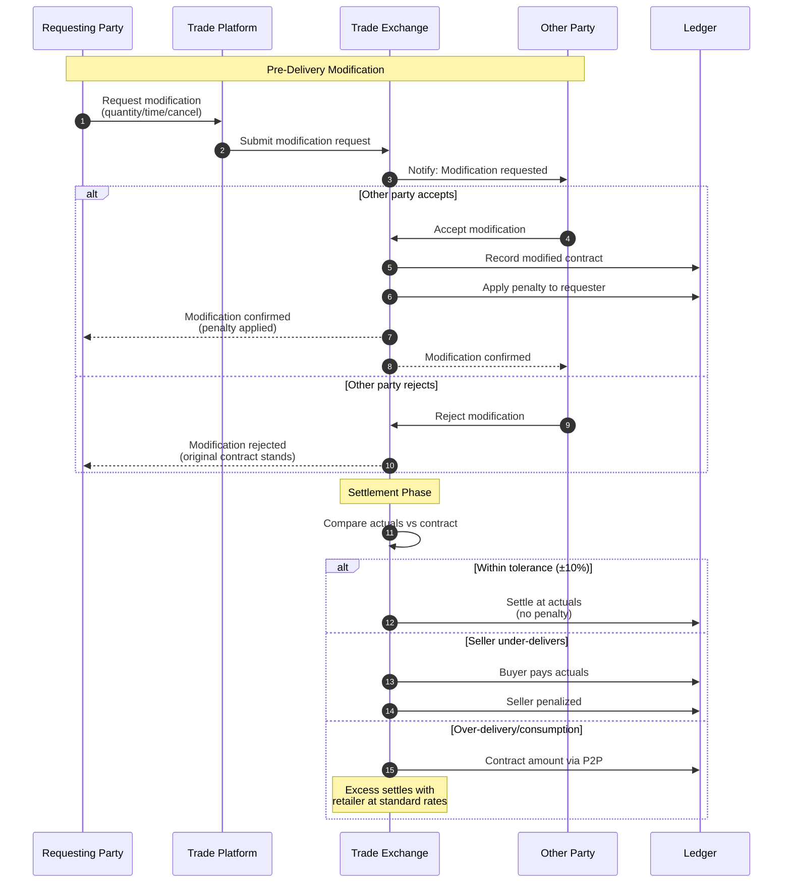

---

## Open Questions

1. **Settlement Mechanism:** Which approach (clearing house, money block, hybrid, prepaid) and why?

2. **Smart Meter Data Latency:** How quickly can energy retailers release meter data to trade exchanges? This is the binding constraint on settlement timelines.

3. **Inter-institution Enforcement:** If buyer defaults and buyer's energy retailer needs to act, what compels retailer B to enforce on behalf of a seller in retailer A's territory? What's the contractual or regulatory mechanism?

4. **Future Trade Horizon:** Should v1 allow long-horizon trades (T+30, T+60)? If yes, we need the full futures/options complexity.

5. **Regulatory Structure:** If multiple trade exchanges exist, who regulates them? How do we ensure interoperability (or do we)?

6. **Partial Fulfillment:** How do we deal with partial fulfilment of contract? Is it an all or none model?

---

[^1]: Non-exhaustive
