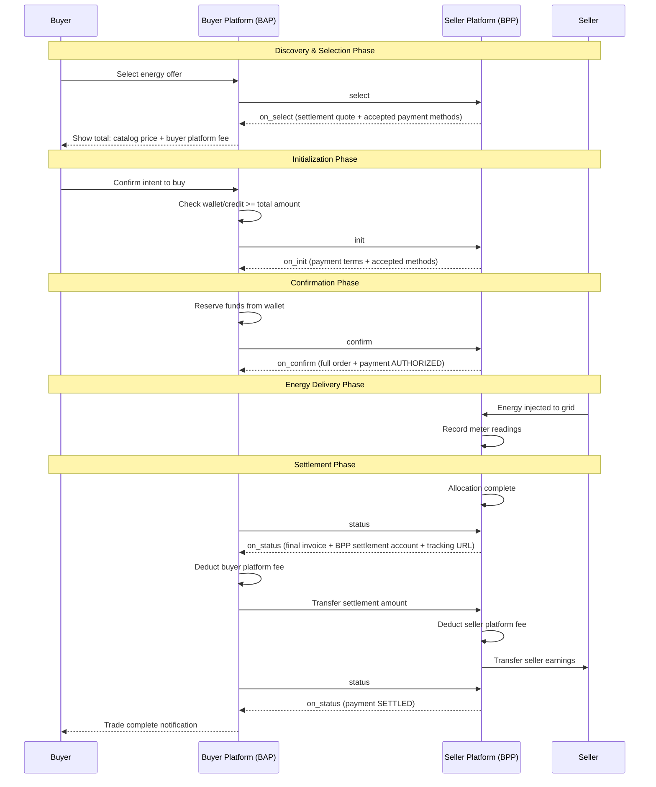

# Payment Design for Inter-Utility Peer to Peer Energy Trading <!-- omit from toc -->

Version 0.1 (Non-Normative)

## Table of contents <!-- omit from toc -->
- [1. Overview](#1-overview)
- [2. Design Principles](#2-design-principles)
  - [2.1. Peer-to-Peer Transparency](#21-peer-to-peer-transparency)
  - [2.2. Bill Component Transparency](#22-bill-component-transparency)
  - [2.3. Settlement Flow](#23-settlement-flow)
- [3. Sequence Diagram](#3-sequence-diagram)
- [4. Payment Status Lifecycle](#4-payment-status-lifecycle)
- [5. Bill Components](#5-bill-components)
- [6. Message Flow Examples](#6-message-flow-examples)
  - [6.1. on\_select: Settlement Quote + Accepted Payment Methods](#61-on_select-settlement-quote--accepted-payment-methods)
  - [6.2. on\_init: Payment Terms Confirmation](#62-on_init-payment-terms-confirmation)
  - [6.3. on\_confirm: Order Confirmation](#63-on_confirm-order-confirmation)
  - [6.4. on\_update: Partial Delivery (Curtailment)](#64-on_update-partial-delivery-curtailment)
  - [6.5. on\_status: Final Invoice (After Allocation)](#65-on_status-final-invoice-after-allocation)
  - [6.6. on\_status: Settlement Complete](#66-on_status-settlement-complete)
  - [6.7. on\_status: Trade Completed](#67-on_status-trade-completed)
- [7. Key Design Decisions](#7-key-design-decisions)
  - [7.1. Why Platform-to-Platform Settlement?](#71-why-platform-to-platform-settlement)
  - [7.2. Customer Agency](#72-customer-agency)
  - [7.3. Discom's Role](#73-discoms-role)
- [8. Implementation Notes](#8-implementation-notes)
  - [8.1. For Buyer Platforms (BAP)](#81-for-buyer-platforms-bap)
  - [8.2. For Seller Platforms (BPP)](#82-for-seller-platforms-bpp)

## 1. Overview

This note documents the payment flow design for peer-to-peer energy trading across distribution companies (discoms). While trading platforms act as intermediaries facilitating transactions, the fundamental nature remains **peer-to-peer**: energy flows from one prosumer to another consumer, and payment should reflect this direct relationship.

## 2. Design Principles

### 2.1. Peer-to-Peer Transparency

Even though payments flow through platforms (BAP → BPP), the underlying transaction is between two individuals:
- **Seller (Prosumer)**: Generates excess energy and sells it
- **Buyer (Consumer)**: Purchases energy from the seller

Platforms act with **delegated agency** on behalf of their customers. This means:
- Each platform must provide **full visibility** to their own customer about applicable fees
- In future implementations, it is conceivable that customers may **pay sellers directly**

### 2.2. Inter-Platform Privacy & Fee Transparency

Platform fees are private to each platform and are **not disclosed in inter-platform protocol messages**. The `orderValue` in protocol messages only contains the **net settlement amount** between platforms (based on catalog prices).

**Catalog prices** are inclusive of seller platform charges. During discovery, the buyer platform (BAP) adds its own fee on top for the buyer-facing display.

**Recommendation for platforms:**
- **Buyer platforms (BAP)**: Disclose the buyer platform fee to the buyer upfront. Show the buyer: catalog price + buyer platform fee = total cost per unit.
- **Seller platforms (BPP)**: Disclose the seller platform fee to the seller upfront. The catalog price already includes the seller platform fee; the seller should understand their net earnings after the platform deduction.

Optionally, platforms can also indicate the wheeling charges & deviation penalty that the utility will bill separately, outside this p2p transaction. That will give customers a full picture of all opportunity costs involved in engaging in a trade.

This ensures informed consent while maintaining fee privacy between competing platforms.

### 2.3. Settlement Flow

The payment settlement follows a clear progression:
1. **Authorization**: Buyer platform verifies wallet balance or credit line covers total amount (catalog price + buyer platform fee)
2. **Allocation**: After energy delivery is confirmed via meter readings
3. **Final Invoice (via on_status)**: Buyer platform queries status; seller platform responds with invoice including BPP settlement account
4. **Settlement**: Money moves from buyer platform to seller platform (at catalog price), then seller platform deducts its fee and pays the seller

## 3. Sequence Diagram



## 4. Payment Status Lifecycle

| Status | When | Meaning |
|--------|------|---------|
| `PENDING` | on_select | Awaiting buyer decision |
| `INITIATED` | init | Payment process started |
| `AUTHORIZED` | on_init → on_confirm | Funds reserved, trade approved |
| `ADJUSTED` | on_update (curtailment) | Amount changed due to partial delivery |
| `SETTLED` | on_status (settlement complete) | Money transferred to all parties |

## 5. Inter-Platform Settlement Value

The `beckn:orderValue` in protocol messages between BAP and BPP contains only the **net settlement amount** — the total value to be transferred from buyer platform to seller platform. Platform fees are not itemized in the protocol exchange.

```json
{
  "currency": "USD",
  "value": 4.05,
  "description": "Inter-platform settlement at catalog prices (15 kWh × $0.15 + 10 kWh × $0.18). Catalog prices are inclusive of seller platform charges."
}
```

**How platform fees work (not part of protocol messages):**
- **Catalog price** ($0.15/kWh, $0.18/kWh) is set by the seller platform and includes the seller platform fee
- **Buyer platform** adds its own fee on top when presenting the price to the buyer
- **Settlement**: BAP pays BPP the catalog-price-based amount ($4.05). BPP deducts seller platform fee and pays the seller. BAP deducts buyer platform fee from what it collected from the buyer.

## 6. Message Flow Examples

### 6.1. on_select: Settlement Quote + Accepted Payment Methods

At selection, the seller platform returns the inter-platform settlement quote and accepted payment methods. The settlement value is based on catalog prices (which are inclusive of seller platform charges). The buyer platform (BAP) adds its own fee when presenting the total to the buyer.

<details>
<summary><a href="../../../../examples/p2p-trading-interdiscom/v2/select-response.json">on_select Response</a></summary>

```json
{
  "context": {
    "version": "2.0.0",
    "action": "on_select",
    "timestamp": "2024-10-04T10:15:05Z",
    "message_id": "msg-on-select-001",
    "transaction_id": "txn-energy-001",
    "bap_id": "bap.energy-consumer.com",
    "bap_uri": "https://bap.energy-consumer.com",
    "bpp_id": "bpp.energy-provider.com",
    "bpp_uri": "https://bpp.energy-provider.com",
    "ttl": "PT30S",
    "domain": "beckn.one:deg:p2p-trading-interdiscom:2.0.0"
  },
  "message": {
    "order": {
      "@context": "https://raw.githubusercontent.com/beckn/protocol-specifications-v2/tags/core-2.0.0-rc-eos-release/schema/core/v2/context.jsonld",
      "@type": "beckn:Order",
      "beckn:orderStatus": "CREATED",
      "beckn:seller": "provider-solar-farm-001",
      "beckn:buyer": {
        "@context": "https://raw.githubusercontent.com/beckn/protocol-specifications-v2/tags/core-2.0.0-rc-eos-release/schema/core/v2/context.jsonld",
        "@type": "beckn:Buyer",
        "beckn:id": "buyer-001",
        "beckn:buyerAttributes": {
          "@context": "https://raw.githubusercontent.com/beckn/DEG/tags/deg-1.0.0/specification/schema/EnergyTrade/v0.3/context.jsonld",
          "@type": "EnergyCustomer",
          "meterId": "der://meter/98765456",
          "utilityCustomerId": "BESCOM-CUST-001",
          "utilityId": "BESCOM-KA"
        }
      },
      "beckn:orderAttributes": {
        "@context": "https://raw.githubusercontent.com/beckn/DEG/tags/deg-1.0.0/specification/schema/EnergyTrade/v0.3/context.jsonld",
        "@type": "EnergyTradeOrder",
        "bap_id": "bap.energy-consumer.com",
        "bpp_id": "bpp.energy-provider.com",
        "total_quantity": {
          "unitQuantity": 25.0,
          "unitText": "kWh"
        }
      },
      "beckn:orderValue": {
        "currency": "USD",
        "value": 4.05,
        "description": "Inter-platform settlement at catalog prices (15 kWh × $0.15 + 10 kWh × $0.18). Catalog prices are inclusive of seller platform charges."
      },
      "beckn:payment": {
        "@context": "https://raw.githubusercontent.com/beckn/protocol-specifications-v2/tags/core-2.0.0-rc-eos-release/schema/core/v2/context.jsonld",
        "@type": "beckn:Payment",
        "beckn:paymentStatus": "PENDING",
        "beckn:acceptedPaymentMethod": ["UPI", "BANK_TRANSFER", "WALLET"]
      },
      "beckn:orderItems": [
        {
          "beckn:orderedItem": "energy-resource-solar-001",
          "beckn:orderItemAttributes": {
            "@context": "https://raw.githubusercontent.com/beckn/DEG/tags/deg-1.0.0/specification/schema/EnergyTrade/v0.3/context.jsonld",
            "@type": "EnergyOrderItem",
            "providerAttributes": {
              "@context": "https://raw.githubusercontent.com/beckn/DEG/tags/deg-1.0.0/specification/schema/EnergyTrade/v0.3/context.jsonld",
              "@type": "EnergyCustomer",
              "meterId": "der://meter/98765456",
              "utilityCustomerId": "BESCOM-CUST-001",
              "utilityId": "BESCOM-KA"
            }
          },
          "beckn:quantity": {
            "unitQuantity": 15.0,
            "unitText": "kWh"
          },
          "beckn:acceptedOffer": {
            "@context": "https://raw.githubusercontent.com/beckn/protocol-specifications-v2/tags/core-2.0.0-rc-eos-release/schema/core/v2/context.jsonld",
            "@type": "beckn:Offer",
            "beckn:id": "offer-morning-001",
            "beckn:descriptor": {
              "@type": "beckn:Descriptor",
              "schema:name": "Morning Solar Energy Offer"
            },
            "beckn:provider": "provider-solar-farm-001",
            "beckn:items": [
              "energy-resource-solar-001"
            ],
            "beckn:price": {
              "@type": "schema:PriceSpecification",
              "schema:price": 0.15,
              "schema:priceCurrency": "USD",
              "unitText": "kWh",
              "applicableQuantity": {
                "unitQuantity": 20.0,
                "unitText": "kWh"
              }
            },
            "beckn:offerAttributes": {
              "@context": "https://raw.githubusercontent.com/beckn/DEG/tags/deg-1.0.0/specification/schema/EnergyTrade/v0.3/context.jsonld",
              "@type": "EnergyTradeOffer",
              "pricingModel": "PER_KWH",
              "deliveryWindow": {
                "@type": "beckn:TimePeriod",
                "schema:startTime": "2026-01-09T06:00:00Z",
                "schema:endTime": "2026-01-09T12:00:00Z"
              },
              "validityWindow": {
                "@type": "beckn:TimePeriod",
                "schema:startTime": "2026-01-09T00:00:00Z",
                "schema:endTime": "2026-01-09T05:00:00Z"
              }
            }
          }
        },
        {
          "beckn:orderedItem": "energy-resource-solar-001",
          "beckn:orderItemAttributes": {
            "@context": "https://raw.githubusercontent.com/beckn/DEG/tags/deg-1.0.0/specification/schema/EnergyTrade/v0.3/context.jsonld",
            "@type": "EnergyOrderItem",
            "providerAttributes": {
              "@context": "https://raw.githubusercontent.com/beckn/DEG/tags/deg-1.0.0/specification/schema/EnergyTrade/v0.3/context.jsonld",
              "@type": "EnergyCustomer",
              "meterId": "der://meter/98765456",
              "utilityCustomerId": "BESCOM-CUST-001",
              "utilityId": "BESCOM-KA"
            }
          },
          "beckn:quantity": {
            "unitQuantity": 10.0,
            "unitText": "kWh"
          },
          "beckn:acceptedOffer": {
            "@context": "https://raw.githubusercontent.com/beckn/protocol-specifications-v2/tags/core-2.0.0-rc-eos-release/schema/core/v2/context.jsonld",
            "@type": "beckn:Offer",
            "beckn:id": "offer-afternoon-001",
            "beckn:descriptor": {
              "@type": "beckn:Descriptor",
              "schema:name": "Afternoon Solar Energy Offer"
            },
            "beckn:provider": "provider-solar-farm-001",
            "beckn:items": [
              "energy-resource-solar-001"
            ],
            "beckn:price": {
              "@type": "schema:PriceSpecification",
              "schema:price": 0.18,
              "schema:priceCurrency": "USD",
              "unitText": "kWh",
              "applicableQuantity": {
                "unitQuantity": 15.0,
                "unitText": "kWh"
              }
            },
            "beckn:offerAttributes": {
              "@context": "https://raw.githubusercontent.com/beckn/DEG/tags/deg-1.0.0/specification/schema/EnergyTrade/v0.3/context.jsonld",
              "@type": "EnergyTradeOffer",
              "pricingModel": "PER_KWH",
              "deliveryWindow": {
                "@type": "beckn:TimePeriod",
                "schema:startTime": "2026-01-09T12:00:00Z",
                "schema:endTime": "2026-01-09T18:00:00Z"
              },
              "validityWindow": {
                "@type": "beckn:TimePeriod",
                "schema:startTime": "2026-01-09T00:00:00Z",
                "schema:endTime": "2026-01-09T11:00:00Z"
              }
            }
          }
        }
      ]
    }
  }
}

```
</details>

### 6.2. on_init: Payment Terms Confirmation

The initialization response confirms accepted payment methods and the settlement amount. Settlement account details are **not exchanged at this stage** — the BPP settlement account is provided later at the final invoice stage.

<details>
<summary><a href="../../../../examples/p2p-trading-interdiscom/v2/init-response.json">on_init Response</a></summary>

```json
{
  "context": {
    "version": "2.0.0",
    "action": "on_init",
    "timestamp": "2024-10-04T10:20:05Z",
    "message_id": "msg-on-init-001",
    "transaction_id": "txn-energy-001",
    "bap_id": "bap.energy-consumer.com",
    "bap_uri": "https://bap.energy-consumer.com",
    "bpp_id": "bpp.energy-provider.com",
    "bpp_uri": "https://bpp.energy-provider.com",
    "ttl": "PT30S",
    "domain": "beckn.one:deg:p2p-trading-interdiscom:2.0.0"
  },
  "message": {
    "order": {
      "@context": "https://raw.githubusercontent.com/beckn/protocol-specifications-v2/tags/core-2.0.0-rc-eos-release/schema/core/v2/context.jsonld",
      "@type": "beckn:Order",
      "beckn:orderStatus": "CREATED",
      "beckn:seller": "provider-solar-farm-001",
      "beckn:buyer": {
        "@context": "https://raw.githubusercontent.com/beckn/protocol-specifications-v2/tags/core-2.0.0-rc-eos-release/schema/core/v2/context.jsonld",
        "@type": "beckn:Buyer",
        "beckn:id": "buyer-001",
        "beckn:buyerAttributes": {
          "@context": "https://raw.githubusercontent.com/beckn/DEG/tags/deg-1.0.0/specification/schema/EnergyTrade/v0.3/context.jsonld",
          "@type": "EnergyCustomer",
          "meterId": "der://meter/98765456",
          "utilityCustomerId": "BESCOM-CUST-001",
          "utilityId": "BESCOM-KA"
        }
      },
      "beckn:orderAttributes": {
        "@context": "https://raw.githubusercontent.com/beckn/DEG/tags/deg-1.0.0/specification/schema/EnergyTrade/v0.3/context.jsonld",
        "@type": "EnergyTradeOrder",
        "bap_id": "bap.energy-consumer.com",
        "bpp_id": "bpp.energy-provider.com",
        "total_quantity": {
          "unitQuantity": 25.0,
          "unitText": "kWh"
        }
      },
      "beckn:orderItems": [
        {
          "beckn:orderedItem": "energy-resource-solar-001",
          "beckn:quantity": {
            "unitQuantity": 15.0,
            "unitText": "kWh"
          },
          "beckn:orderItemAttributes": {
            "@context": "https://raw.githubusercontent.com/beckn/DEG/tags/deg-1.0.0/specification/schema/EnergyTrade/v0.3/context.jsonld",
            "@type": "EnergyOrderItem",
            "providerAttributes": {
              "@context": "https://raw.githubusercontent.com/beckn/DEG/tags/deg-1.0.0/specification/schema/EnergyTrade/v0.3/context.jsonld",
              "@type": "EnergyCustomer",
              "meterId": "der://meter/98765456",
              "utilityCustomerId": "BESCOM-CUST-001",
              "utilityId": "BESCOM-KA"
            }
          },
          "beckn:acceptedOffer": {
            "@context": "https://raw.githubusercontent.com/beckn/protocol-specifications-v2/tags/core-2.0.0-rc-eos-release/schema/core/v2/context.jsonld",
            "@type": "beckn:Offer",
            "beckn:id": "offer-morning-001",
            "beckn:descriptor": {
              "@type": "beckn:Descriptor",
              "schema:name": "Morning Solar Energy Offer"
            },
            "beckn:provider": "provider-solar-farm-001",
            "beckn:items": [
              "energy-resource-solar-001"
            ],
            "beckn:price": {
              "@type": "schema:PriceSpecification",
              "schema:price": 0.15,
              "schema:priceCurrency": "USD",
              "unitText": "kWh",
              "applicableQuantity": {
                "unitQuantity": 20.0,
                "unitText": "kWh"
              }
            },
            "beckn:offerAttributes": {
              "@context": "https://raw.githubusercontent.com/beckn/DEG/tags/deg-1.0.0/specification/schema/EnergyTrade/v0.3/context.jsonld",
              "@type": "EnergyTradeOffer",
              "pricingModel": "PER_KWH",
              "deliveryWindow": {
                "@type": "beckn:TimePeriod",
                "schema:startTime": "2026-01-09T06:00:00Z",
                "schema:endTime": "2026-01-09T12:00:00Z"
              },
              "validityWindow": {
                "@type": "beckn:TimePeriod",
                "schema:startTime": "2026-01-09T00:00:00Z",
                "schema:endTime": "2026-01-09T05:00:00Z"
              }
            }
          }
        },
        {
          "beckn:orderedItem": "energy-resource-solar-001",
          "beckn:quantity": {
            "unitQuantity": 10.0,
            "unitText": "kWh"
          },
          "beckn:orderItemAttributes": {
            "@context": "https://raw.githubusercontent.com/beckn/DEG/tags/deg-1.0.0/specification/schema/EnergyTrade/v0.3/context.jsonld",
            "@type": "EnergyOrderItem",
            "providerAttributes": {
              "@context": "https://raw.githubusercontent.com/beckn/DEG/tags/deg-1.0.0/specification/schema/EnergyTrade/v0.3/context.jsonld",
              "@type": "EnergyCustomer",
              "meterId": "der://meter/98765456",
              "utilityCustomerId": "BESCOM-CUST-001",
              "utilityId": "BESCOM-KA"
            }
          },
          "beckn:acceptedOffer": {
            "@context": "https://raw.githubusercontent.com/beckn/protocol-specifications-v2/tags/core-2.0.0-rc-eos-release/schema/core/v2/context.jsonld",
            "@type": "beckn:Offer",
            "beckn:id": "offer-afternoon-001",
            "beckn:descriptor": {
              "@type": "beckn:Descriptor",
              "schema:name": "Afternoon Solar Energy Offer"
            },
            "beckn:provider": "provider-solar-farm-001",
            "beckn:items": [
              "energy-resource-solar-001"
            ],
            "beckn:price": {
              "@type": "schema:PriceSpecification",
              "schema:price": 0.18,
              "schema:priceCurrency": "USD",
              "unitText": "kWh",
              "applicableQuantity": {
                "unitQuantity": 15.0,
                "unitText": "kWh"
              }
            },
            "beckn:offerAttributes": {
              "@context": "https://raw.githubusercontent.com/beckn/DEG/tags/deg-1.0.0/specification/schema/EnergyTrade/v0.3/context.jsonld",
              "@type": "EnergyTradeOffer",
              "pricingModel": "PER_KWH",
              "deliveryWindow": {
                "@type": "beckn:TimePeriod",
                "schema:startTime": "2026-01-09T12:00:00Z",
                "schema:endTime": "2026-01-09T18:00:00Z"
              },
              "validityWindow": {
                "@type": "beckn:TimePeriod",
                "schema:startTime": "2026-01-09T00:00:00Z",
                "schema:endTime": "2026-01-09T11:00:00Z"
              }
            }
          }
        }
      ],
      "beckn:orderValue": {
        "currency": "USD",
        "value": 4.05,
        "description": "Inter-platform settlement at catalog prices (15 kWh × $0.15 + 10 kWh × $0.18). Catalog prices are inclusive of seller platform charges."
      },
      "beckn:fulfillment": {
        "@context": "https://raw.githubusercontent.com/beckn/protocol-specifications-v2/tags/core-2.0.0-rc-eos-release/schema/core/v2/context.jsonld",
        "@type": "beckn:Fulfillment",
        "beckn:id": "fulfillment-energy-001",
        "beckn:mode": "DELIVERY"
      },
      "beckn:payment": {
        "@context": "https://raw.githubusercontent.com/beckn/protocol-specifications-v2/tags/core-2.0.0-rc-eos-release/schema/core/v2/context.jsonld",
        "@type": "beckn:Payment",
        "beckn:id": "payment-p2p-energy-001",
        "beckn:amount": {
          "currency": "USD",
          "value": 4.05
        },
        "beckn:acceptedPaymentMethod": ["UPI", "BANK_TRANSFER", "WALLET"],
        "beckn:beneficiary": "BPP",
        "beckn:paymentStatus": "AUTHORIZED"
      }
    }
  }
}

```
</details>

### 6.3. on_confirm: Order Confirmation

The confirmation response returns the full order details with payment status AUTHORIZED, mirroring the information from on_init. This serves as the definitive record of the agreed trade terms.

<details>
<summary><a href="../../../../examples/p2p-trading-interdiscom/v2/confirm-response.json">on_confirm Response</a></summary>

```json
{
  "context": {
    "version": "2.0.0",
    "action": "on_confirm",
    "timestamp": "2024-10-04T10:25:05Z",
    "message_id": "msg-on-confirm-001",
    "transaction_id": "txn-energy-001",
    "bap_id": "bap.energy-consumer.com",
    "bap_uri": "https://bap.energy-consumer.com",
    "bpp_id": "bpp.energy-provider.com",
    "bpp_uri": "https://bpp.energy-provider.com",
    "ttl": "PT30S",
    "domain": "beckn.one:deg:p2p-trading-interdiscom:2.0.0"
  },
  "message": {
    "order": {
      "@context": "https://raw.githubusercontent.com/beckn/protocol-specifications-v2/tags/core-2.0.0-rc-eos-release/schema/core/v2/context.jsonld",
      "@type": "beckn:Order",
      "beckn:id": "order-energy-001",
      "beckn:orderStatus": "CREATED",
      "beckn:seller": "provider-solar-farm-001",
      "beckn:buyer": {
        "@context": "https://raw.githubusercontent.com/beckn/protocol-specifications-v2/tags/core-2.0.0-rc-eos-release/schema/core/v2/context.jsonld",
        "@type": "beckn:Buyer",
        "beckn:id": "buyer-001",
        "beckn:buyerAttributes": {
          "@context": "https://raw.githubusercontent.com/beckn/DEG/tags/deg-1.0.0/specification/schema/EnergyTrade/v0.3/context.jsonld",
          "@type": "EnergyCustomer",
          "meterId": "der://meter/98765456",
          "utilityCustomerId": "BESCOM-CUST-001",
          "utilityId": "BESCOM-KA"
        }
      },
      "beckn:orderAttributes": {
        "@context": "https://raw.githubusercontent.com/beckn/DEG/tags/deg-1.0.0/specification/schema/EnergyTrade/v0.3/context.jsonld",
        "@type": "EnergyTradeOrder",
        "bap_id": "bap.energy-consumer.com",
        "bpp_id": "bpp.energy-provider.com",
        "total_quantity": {
          "unitQuantity": 25.0,
          "unitText": "kWh"
        }
      },
      "beckn:orderItems": [
        {
          "beckn:orderedItem": "energy-resource-solar-001",
          "beckn:quantity": {
            "unitQuantity": 15.0,
            "unitText": "kWh"
          },
          "beckn:orderItemAttributes": {
            "@context": "https://raw.githubusercontent.com/beckn/DEG/tags/deg-1.0.0/specification/schema/EnergyTrade/v0.3/context.jsonld",
            "@type": "EnergyOrderItem",
            "providerAttributes": {
              "@context": "https://raw.githubusercontent.com/beckn/DEG/tags/deg-1.0.0/specification/schema/EnergyTrade/v0.3/context.jsonld",
              "@type": "EnergyCustomer",
              "meterId": "der://meter/98765456",
              "utilityCustomerId": "BESCOM-CUST-001",
              "utilityId": "BESCOM-KA"
            }
          },
          "beckn:acceptedOffer": {
            "@context": "https://raw.githubusercontent.com/beckn/protocol-specifications-v2/tags/core-2.0.0-rc-eos-release/schema/core/v2/context.jsonld",
            "@type": "beckn:Offer",
            "beckn:id": "offer-morning-001",
            "beckn:descriptor": {
              "@type": "beckn:Descriptor",
              "schema:name": "Morning Solar Energy Offer"
            },
            "beckn:provider": "provider-solar-farm-001",
            "beckn:items": [
              "energy-resource-solar-001"
            ],
            "beckn:price": {
              "@type": "schema:PriceSpecification",
              "schema:price": 0.15,
              "schema:priceCurrency": "USD",
              "unitText": "kWh",
              "applicableQuantity": {
                "unitQuantity": 20.0,
                "unitText": "kWh"
              }
            },
            "beckn:offerAttributes": {
              "@context": "https://raw.githubusercontent.com/beckn/DEG/tags/deg-1.0.0/specification/schema/EnergyTrade/v0.3/context.jsonld",
              "@type": "EnergyTradeOffer",
              "pricingModel": "PER_KWH",
              "deliveryWindow": {
                "@type": "beckn:TimePeriod",
                "schema:startTime": "2026-01-09T06:00:00Z",
                "schema:endTime": "2026-01-09T12:00:00Z"
              },
              "validityWindow": {
                "@type": "beckn:TimePeriod",
                "schema:startTime": "2026-01-09T00:00:00Z",
                "schema:endTime": "2026-01-09T05:00:00Z"
              }
            }
          }
        },
        {
          "beckn:orderedItem": "energy-resource-solar-001",
          "beckn:quantity": {
            "unitQuantity": 10.0,
            "unitText": "kWh"
          },
          "beckn:orderItemAttributes": {
            "@context": "https://raw.githubusercontent.com/beckn/DEG/tags/deg-1.0.0/specification/schema/EnergyTrade/v0.3/context.jsonld",
            "@type": "EnergyOrderItem",
            "providerAttributes": {
              "@context": "https://raw.githubusercontent.com/beckn/DEG/tags/deg-1.0.0/specification/schema/EnergyTrade/v0.3/context.jsonld",
              "@type": "EnergyCustomer",
              "meterId": "der://meter/98765456",
              "utilityCustomerId": "BESCOM-CUST-001",
              "utilityId": "BESCOM-KA"
            }
          },
          "beckn:acceptedOffer": {
            "@context": "https://raw.githubusercontent.com/beckn/protocol-specifications-v2/tags/core-2.0.0-rc-eos-release/schema/core/v2/context.jsonld",
            "@type": "beckn:Offer",
            "beckn:id": "offer-afternoon-001",
            "beckn:descriptor": {
              "@type": "beckn:Descriptor",
              "schema:name": "Afternoon Solar Energy Offer"
            },
            "beckn:provider": "provider-solar-farm-001",
            "beckn:items": [
              "energy-resource-solar-001"
            ],
            "beckn:price": {
              "@type": "schema:PriceSpecification",
              "schema:price": 0.18,
              "schema:priceCurrency": "USD",
              "unitText": "kWh",
              "applicableQuantity": {
                "unitQuantity": 15.0,
                "unitText": "kWh"
              }
            },
            "beckn:offerAttributes": {
              "@context": "https://raw.githubusercontent.com/beckn/DEG/tags/deg-1.0.0/specification/schema/EnergyTrade/v0.3/context.jsonld",
              "@type": "EnergyTradeOffer",
              "pricingModel": "PER_KWH",
              "deliveryWindow": {
                "@type": "beckn:TimePeriod",
                "schema:startTime": "2026-01-09T12:00:00Z",
                "schema:endTime": "2026-01-09T18:00:00Z"
              },
              "validityWindow": {
                "@type": "beckn:TimePeriod",
                "schema:startTime": "2026-01-09T00:00:00Z",
                "schema:endTime": "2026-01-09T11:00:00Z"
              }
            }
          }
        }
      ],
      "beckn:orderValue": {
        "currency": "USD",
        "value": 4.05,
        "description": "Inter-platform settlement at catalog prices (15 kWh × $0.15 + 10 kWh × $0.18). Catalog prices are inclusive of seller platform charges."
      },
      "beckn:fulfillment": {
        "@context": "https://raw.githubusercontent.com/beckn/protocol-specifications-v2/tags/core-2.0.0-rc-eos-release/schema/core/v2/context.jsonld",
        "@type": "beckn:Fulfillment",
        "beckn:id": "fulfillment-energy-001",
        "beckn:mode": "DELIVERY"
      },
      "beckn:payment": {
        "@context": "https://raw.githubusercontent.com/beckn/protocol-specifications-v2/tags/core-2.0.0-rc-eos-release/schema/core/v2/context.jsonld",
        "@type": "beckn:Payment",
        "beckn:id": "payment-p2p-energy-001",
        "beckn:amount": {
          "currency": "USD",
          "value": 4.05
        },
        "beckn:beneficiary": "BPP",
        "beckn:paymentStatus": "AUTHORIZED"
      }
    }
  }
}

```
</details>

### 6.4. on_update: Partial Delivery (Curtailment)

If delivery is curtailed (e.g., grid outage), the seller platform pushes an update with the adjusted settlement amount reflecting actual delivered energy.

<details>
<summary><a href="../../../../examples/p2p-trading-interdiscom/v2/on-update-response-curtailment.json">on_update Curtailment</a></summary>

```json
{
  "context": {
    "version": "2.0.0",
    "action": "on_update",
    "timestamp": "2024-10-04T14:30:00Z",
    "message_id": "msg-on-update-curtailment-001",
    "transaction_id": "txn-energy-001",
    "bap_id": "bap.energy-consumer.com",
    "bap_uri": "https://bap.energy-consumer.com",
    "bpp_id": "bpp.energy-provider.com",
    "bpp_uri": "https://bpp.energy-provider.com",
    "ttl": "PT30S",
    "domain": "beckn.one:deg:p2p-trading-interdiscom:2.0.0"
  },
  "message": {
    "order": {
      "@context": "https://raw.githubusercontent.com/beckn/protocol-specifications-v2/tags/core-2.0.0-rc-eos-release/schema/core/v2/context.jsonld",
      "@type": "beckn:Order",
      "beckn:id": "order-energy-001",
      "beckn:orderStatus": "INPROGRESS",
      "beckn:seller": "provider-solar-farm-001",
      "beckn:buyer": {
        "@context": "https://raw.githubusercontent.com/beckn/protocol-specifications-v2/tags/core-2.0.0-rc-eos-release/schema/core/v2/context.jsonld",
        "@type": "beckn:Buyer",
        "beckn:id": "buyer-001",
        "beckn:buyerAttributes": {
          "@context": "https://raw.githubusercontent.com/beckn/DEG/tags/deg-1.0.0/specification/schema/EnergyTrade/v0.3/context.jsonld",
          "@type": "EnergyCustomer",
          "meterId": "der://meter/98765456",
          "utilityCustomerId": "BESCOM-CUST-001",
          "utilityId": "BESCOM-KA"
        }
      },
      "beckn:orderItems": [
        {
          "beckn:orderedItem": "energy-resource-solar-001",
          "beckn:quantity": {
            "unitQuantity": 15.0,
            "unitText": "kWh"
          },
          "beckn:orderItemAttributes": {
            "@context": "https://raw.githubusercontent.com/beckn/DEG/tags/deg-1.0.0/specification/schema/EnergyTrade/v0.3/context.jsonld",
            "@type": "EnergyOrderItem",
            "providerAttributes": {
              "@context": "https://raw.githubusercontent.com/beckn/DEG/tags/deg-1.0.0/specification/schema/EnergyTrade/v0.3/context.jsonld",
              "@type": "EnergyCustomer",
              "meterId": "der://meter/98765456",
              "utilityCustomerId": "BESCOM-CUST-001",
              "utilityId": "BESCOM-KA"
            },
            "fulfillmentAttributes": {
              "@context": "https://raw.githubusercontent.com/beckn/DEG/tags/deg-1.0.0/specification/schema/EnergyTrade/v0.3/context.jsonld",
              "@type": "EnergyTradeDelivery",
              "deliveryStatus": "IN_PROGRESS",
              "deliveryMode": "GRID_INJECTION",
              "deliveredQuantity": 8.5,
              "curtailedQuantity": 6.5,
              "curtailmentReason": "GRID_OUTAGE",
              "meterReadings": [
                {
                  "beckn:timeWindow": {
                    "@type": "beckn:TimePeriod",
                    "schema:startTime": "2024-10-04T06:00:00Z",
                    "schema:endTime": "2024-10-04T12:00:00Z"
                  },
                  "consumedEnergy": 0.0,
                  "producedEnergy": 8.5,
                  "allocatedEnergy": 8.5,
                  "unit": "kWh"
                }
              ],
              "lastUpdated": "2024-10-04T14:30:00Z"
            }
          },
          "beckn:acceptedOffer": {
            "@context": "https://raw.githubusercontent.com/beckn/protocol-specifications-v2/tags/core-2.0.0-rc-eos-release/schema/core/v2/context.jsonld",
            "@type": "beckn:Offer",
            "beckn:id": "offer-morning-001",
            "beckn:descriptor": {
              "@type": "beckn:Descriptor",
              "schema:name": "Morning Solar Energy Offer"
            },
            "beckn:provider": "provider-solar-farm-001",
            "beckn:items": [
              "energy-resource-solar-001"
            ],
            "beckn:price": {
              "@type": "schema:PriceSpecification",
              "schema:price": 0.15,
              "schema:priceCurrency": "USD",
              "unitText": "kWh",
              "applicableQuantity": {
                "unitQuantity": 20.0,
                "unitText": "kWh"
              }
            },
            "beckn:offerAttributes": {
              "@context": "https://raw.githubusercontent.com/beckn/DEG/tags/deg-1.0.0/specification/schema/EnergyTrade/v0.3/context.jsonld",
              "@type": "EnergyTradeOffer",
              "pricingModel": "PER_KWH",
              "deliveryWindow": {
                "@type": "beckn:TimePeriod",
                "schema:startTime": "2026-01-09T06:00:00Z",
                "schema:endTime": "2026-01-09T12:00:00Z"
              },
              "validityWindow": {
                "@type": "beckn:TimePeriod",
                "schema:startTime": "2026-01-09T00:00:00Z",
                "schema:endTime": "2026-01-09T05:00:00Z"
              }
            }
          }
        }
      ],
      "beckn:orderValue": {
        "currency": "USD",
        "value": 1.28,
        "description": "Adjusted inter-platform settlement for delivered quantity (8.5 kWh × $0.15). Catalog prices are inclusive of seller platform charges."
      },
      "beckn:payment": {
        "@context": "https://raw.githubusercontent.com/beckn/protocol-specifications-v2/tags/core-2.0.0-rc-eos-release/schema/core/v2/context.jsonld",
        "@type": "beckn:Payment",
        "beckn:id": "payment-p2p-energy-001",
        "beckn:amount": {
          "currency": "USD",
          "value": 1.28
        },
        "beckn:beneficiary": "BPP",
        "beckn:paymentStatus": "ADJUSTED"
      }
    }
  }
}

```
</details>

### 6.5. on_status: Final Invoice (After Allocation)

After energy allocation is complete, the buyer platform queries status. The seller platform responds with the final invoice including:
- Final settlement amount based on actual delivered quantities
- BPP settlement account for payment transfer
- Payment tracking URL for transparency

<details>
<summary><a href="../../../../examples/p2p-trading-interdiscom/v2/status-response-final-invoice.json">on_status Final Invoice</a></summary>

```json
{
  "context": {
    "version": "2.0.0",
    "action": "on_status",
    "timestamp": "2024-10-04T18:15:00Z",
    "message_id": "msg-on-status-final-invoice-001",
    "transaction_id": "txn-energy-001",
    "bap_id": "bap.energy-consumer.com",
    "bap_uri": "https://bap.energy-consumer.com",
    "bpp_id": "bpp.energy-provider.com",
    "bpp_uri": "https://bpp.energy-provider.com",
    "ttl": "PT30S",
    "domain": "beckn.one:deg:p2p-trading-interdiscom:2.0.0"
  },
  "message": {
    "order": {
      "@context": "https://raw.githubusercontent.com/beckn/protocol-specifications-v2/tags/core-2.0.0-rc-eos-release/schema/core/v2/context.jsonld",
      "@type": "beckn:Order",
      "beckn:id": "order-energy-001",
      "beckn:orderStatus": "INPROGRESS",
      "beckn:seller": "provider-solar-farm-001",
      "beckn:buyer": {
        "@context": "https://raw.githubusercontent.com/beckn/protocol-specifications-v2/tags/core-2.0.0-rc-eos-release/schema/core/v2/context.jsonld",
        "@type": "beckn:Buyer",
        "beckn:id": "buyer-001",
        "beckn:buyerAttributes": {
          "@context": "https://raw.githubusercontent.com/beckn/DEG/tags/deg-1.0.0/specification/schema/EnergyTrade/v0.3/context.jsonld",
          "@type": "EnergyCustomer",
          "meterId": "der://meter/98765456",
          "utilityCustomerId": "BESCOM-CUST-001",
          "utilityId": "BESCOM-KA"
        }
      },
      "beckn:orderItems": [
        {
          "beckn:orderedItem": "energy-resource-solar-001",
          "beckn:quantity": {
            "unitQuantity": 15.0,
            "unitText": "kWh"
          },
          "beckn:orderItemAttributes": {
            "@context": "https://raw.githubusercontent.com/beckn/DEG/tags/deg-1.0.0/specification/schema/EnergyTrade/v0.3/context.jsonld",
            "@type": "EnergyOrderItem",
            "providerAttributes": {
              "@context": "https://raw.githubusercontent.com/beckn/DEG/tags/deg-1.0.0/specification/schema/EnergyTrade/v0.3/context.jsonld",
              "@type": "EnergyCustomer",
              "meterId": "der://meter/98765456",
              "utilityCustomerId": "BESCOM-CUST-001",
              "utilityId": "BESCOM-KA"
            },
            "fulfillmentAttributes": {
              "@context": "https://raw.githubusercontent.com/beckn/DEG/tags/deg-1.0.0/specification/schema/EnergyTrade/v0.3/context.jsonld",
              "@type": "EnergyTradeDelivery",
              "deliveryStatus": "COMPLETED",
              "deliveryMode": "GRID_INJECTION",
              "deliveredQuantity": 15.0,
              "meterReadings": [
                {
                  "beckn:timeWindow": {
                    "@type": "beckn:TimePeriod",
                    "schema:startTime": "2024-10-04T06:00:00Z",
                    "schema:endTime": "2024-10-04T12:00:00Z"
                  },
                  "consumedEnergy": 0.0,
                  "producedEnergy": 15.0,
                  "allocatedEnergy": 15.0,
                  "unit": "kWh"
                }
              ],
              "lastUpdated": "2024-10-04T18:00:00Z"
            }
          },
          "beckn:acceptedOffer": {
            "@context": "https://raw.githubusercontent.com/beckn/protocol-specifications-v2/tags/core-2.0.0-rc-eos-release/schema/core/v2/context.jsonld",
            "@type": "beckn:Offer",
            "beckn:id": "offer-morning-001",
            "beckn:descriptor": {
              "@type": "beckn:Descriptor",
              "schema:name": "Morning Solar Energy Offer"
            },
            "beckn:provider": "provider-solar-farm-001",
            "beckn:items": [
              "energy-resource-solar-001"
            ],
            "beckn:price": {
              "@type": "schema:PriceSpecification",
              "schema:price": 0.15,
              "schema:priceCurrency": "USD",
              "unitText": "kWh",
              "applicableQuantity": {
                "unitQuantity": 20.0,
                "unitText": "kWh"
              }
            },
            "beckn:offerAttributes": {
              "@context": "https://raw.githubusercontent.com/beckn/DEG/tags/deg-1.0.0/specification/schema/EnergyTrade/v0.3/context.jsonld",
              "@type": "EnergyTradeOffer",
              "pricingModel": "PER_KWH",
              "deliveryWindow": {
                "@type": "beckn:TimePeriod",
                "schema:startTime": "2026-01-09T06:00:00Z",
                "schema:endTime": "2026-01-09T12:00:00Z"
              },
              "validityWindow": {
                "@type": "beckn:TimePeriod",
                "schema:startTime": "2026-01-09T00:00:00Z",
                "schema:endTime": "2026-01-09T05:00:00Z"
              }
            }
          }
        },
        {
          "beckn:orderedItem": "energy-resource-solar-001",
          "beckn:quantity": {
            "unitQuantity": 10.0,
            "unitText": "kWh"
          },
          "beckn:orderItemAttributes": {
            "@context": "https://raw.githubusercontent.com/beckn/DEG/tags/deg-1.0.0/specification/schema/EnergyTrade/v0.3/context.jsonld",
            "@type": "EnergyOrderItem",
            "providerAttributes": {
              "@context": "https://raw.githubusercontent.com/beckn/DEG/tags/deg-1.0.0/specification/schema/EnergyTrade/v0.3/context.jsonld",
              "@type": "EnergyCustomer",
              "meterId": "der://meter/98765456",
              "utilityCustomerId": "BESCOM-CUST-001",
              "utilityId": "BESCOM-KA"
            },
            "fulfillmentAttributes": {
              "@context": "https://raw.githubusercontent.com/beckn/DEG/tags/deg-1.0.0/specification/schema/EnergyTrade/v0.3/context.jsonld",
              "@type": "EnergyTradeDelivery",
              "deliveryStatus": "COMPLETED",
              "deliveryMode": "GRID_INJECTION",
              "deliveredQuantity": 10.0,
              "meterReadings": [
                {
                  "beckn:timeWindow": {
                    "@type": "beckn:TimePeriod",
                    "schema:startTime": "2024-10-04T12:00:00Z",
                    "schema:endTime": "2024-10-04T18:00:00Z"
                  },
                  "consumedEnergy": 0.0,
                  "producedEnergy": 10.0,
                  "allocatedEnergy": 10.0,
                  "unit": "kWh"
                }
              ],
              "lastUpdated": "2024-10-04T18:00:00Z"
            }
          },
          "beckn:acceptedOffer": {
            "@context": "https://raw.githubusercontent.com/beckn/protocol-specifications-v2/tags/core-2.0.0-rc-eos-release/schema/core/v2/context.jsonld",
            "@type": "beckn:Offer",
            "beckn:id": "offer-afternoon-001",
            "beckn:descriptor": {
              "@type": "beckn:Descriptor",
              "schema:name": "Afternoon Solar Energy Offer"
            },
            "beckn:provider": "provider-solar-farm-001",
            "beckn:items": [
              "energy-resource-solar-001"
            ],
            "beckn:price": {
              "@type": "schema:PriceSpecification",
              "schema:price": 0.18,
              "schema:priceCurrency": "USD",
              "unitText": "kWh",
              "applicableQuantity": {
                "unitQuantity": 15.0,
                "unitText": "kWh"
              }
            },
            "beckn:offerAttributes": {
              "@context": "https://raw.githubusercontent.com/beckn/DEG/tags/deg-1.0.0/specification/schema/EnergyTrade/v0.3/context.jsonld",
              "@type": "EnergyTradeOffer",
              "pricingModel": "PER_KWH",
              "deliveryWindow": {
                "@type": "beckn:TimePeriod",
                "schema:startTime": "2026-01-09T12:00:00Z",
                "schema:endTime": "2026-01-09T18:00:00Z"
              },
              "validityWindow": {
                "@type": "beckn:TimePeriod",
                "schema:startTime": "2026-01-09T00:00:00Z",
                "schema:endTime": "2026-01-09T11:00:00Z"
              }
            }
          }
        }
      ],
      "beckn:orderValue": {
        "currency": "USD",
        "value": 4.05,
        "description": "Inter-platform settlement at catalog prices (15 kWh × $0.15 + 10 kWh × $0.18). Catalog prices are inclusive of seller platform charges."
      },
      "beckn:payment": {
        "@context": "https://raw.githubusercontent.com/beckn/protocol-specifications-v2/tags/core-2.0.0-rc-eos-release/schema/core/v2/context.jsonld",
        "@type": "beckn:Payment",
        "beckn:id": "payment-p2p-energy-001",
        "beckn:amount": {
          "currency": "USD",
          "value": 4.05
        },
        "beckn:beneficiary": "BPP",
        "beckn:paymentStatus": "AUTHORIZED",
        "beckn:acceptedPaymentMethod": ["UPI", "BANK_TRANSFER"],
        "beckn:paymentURL": "https://payments.seller-platform.com/track?txn=TXN-ENERGY-001",
        "beckn:paymentAttributes": {
          "@context": "https://raw.githubusercontent.com/beckn/protocol-specifications-v2/tags/core-2.0.0-rc-eos-release/schema/PaymentSettlement/v1/context.jsonld",
          "@type": "PaymentSettlement",
          "settlementAccounts": [
            {
              "beneficiaryId": "bpp.energy-provider.com",
              "accountHolderName": "Solar Farm Energy Provider Pvt Ltd",
              "accountNumber": "9876543210",
              "ifscCode": "ICICI0005678",
              "bankName": "ICICI Bank",
              "vpa": "solar-provider@upi"
            }
          ]
        }
      }
    }
  }
}

```
</details>

### 6.6. on_status: Settlement Complete

Once money has moved from buyer platform to seller platform (tracked via URL), the buyer platform queries status again and the seller platform confirms the trade as settled.

<details>
<summary><a href="../../../../examples/p2p-trading-interdiscom/v2/status-response-settlement-complete.json">on_status Settlement Complete</a></summary>

```json
{
  "context": {
    "version": "2.0.0",
    "action": "on_status",
    "timestamp": "2024-10-04T18:45:00Z",
    "message_id": "msg-on-status-settlement-complete-001",
    "transaction_id": "txn-energy-001",
    "bap_id": "bap.energy-consumer.com",
    "bap_uri": "https://bap.energy-consumer.com",
    "bpp_id": "bpp.energy-provider.com",
    "bpp_uri": "https://bpp.energy-provider.com",
    "ttl": "PT30S",
    "domain": "beckn.one:deg:p2p-trading-interdiscom:2.0.0"
  },
  "message": {
    "order": {
      "@context": "https://raw.githubusercontent.com/beckn/protocol-specifications-v2/tags/core-2.0.0-rc-eos-release/schema/core/v2/context.jsonld",
      "@type": "beckn:Order",
      "beckn:id": "order-energy-001",
      "beckn:orderStatus": "COMPLETED",
      "beckn:seller": "provider-solar-farm-001",
      "beckn:buyer": {
        "@context": "https://raw.githubusercontent.com/beckn/protocol-specifications-v2/tags/core-2.0.0-rc-eos-release/schema/core/v2/context.jsonld",
        "@type": "beckn:Buyer",
        "beckn:id": "buyer-001",
        "beckn:buyerAttributes": {
          "@context": "https://raw.githubusercontent.com/beckn/DEG/tags/deg-1.0.0/specification/schema/EnergyTrade/v0.3/context.jsonld",
          "@type": "EnergyCustomer",
          "meterId": "der://meter/98765456",
          "utilityCustomerId": "BESCOM-CUST-001",
          "utilityId": "BESCOM-KA"
        }
      },
      "beckn:orderItems": [
        {
          "beckn:orderedItem": "energy-resource-solar-001",
          "beckn:quantity": {
            "unitQuantity": 15.0,
            "unitText": "kWh"
          },
          "beckn:acceptedOffer": {
            "@context": "https://raw.githubusercontent.com/beckn/protocol-specifications-v2/tags/core-2.0.0-rc-eos-release/schema/core/v2/context.jsonld",
            "@type": "beckn:Offer",
            "beckn:id": "offer-morning-001",
            "beckn:descriptor": {
              "@type": "beckn:Descriptor",
              "schema:name": "Morning Solar Energy Offer"
            },
            "beckn:provider": "provider-solar-farm-001",
            "beckn:items": ["energy-resource-solar-001"]
          }
        },
        {
          "beckn:orderedItem": "energy-resource-solar-001",
          "beckn:quantity": {
            "unitQuantity": 10.0,
            "unitText": "kWh"
          },
          "beckn:acceptedOffer": {
            "@context": "https://raw.githubusercontent.com/beckn/protocol-specifications-v2/tags/core-2.0.0-rc-eos-release/schema/core/v2/context.jsonld",
            "@type": "beckn:Offer",
            "beckn:id": "offer-afternoon-001",
            "beckn:descriptor": {
              "@type": "beckn:Descriptor",
              "schema:name": "Afternoon Solar Energy Offer"
            },
            "beckn:provider": "provider-solar-farm-001",
            "beckn:items": ["energy-resource-solar-001"]
          }
        }
      ],
      "beckn:orderValue": {
        "currency": "USD",
        "value": 4.05,
        "description": "Inter-platform settlement at catalog prices (15 kWh × $0.15 + 10 kWh × $0.18). Catalog prices are inclusive of seller platform charges."
      },
      "beckn:payment": {
        "@context": "https://raw.githubusercontent.com/beckn/protocol-specifications-v2/tags/core-2.0.0-rc-eos-release/schema/core/v2/context.jsonld",
        "@type": "beckn:Payment",
        "beckn:id": "payment-p2p-energy-001",
        "beckn:amount": {
          "currency": "USD",
          "value": 4.05
        },
        "beckn:beneficiary": "BPP",
        "beckn:paymentStatus": "SETTLED",
        "beckn:paidAt": "2024-10-04T18:40:00Z",
        "beckn:txnRef": "TXN-ENERGY-001-SETTLED"
      }
    }
  }
}

```
</details>

### 6.7. on_status: Trade Completed

Final status shows the order and payment as complete.

<details>
<summary><a href="../../../../examples/p2p-trading-interdiscom/v2/status-response-completed.json">on_status Completed</a></summary>

```json
{
  "context": {
    "version": "2.0.0",
    "action": "on_status",
    "timestamp": "2024-10-04T18:30:00Z",
    "message_id": "msg-on-status-completed-001",
    "transaction_id": "txn-energy-001",
    "bap_id": "bap.energy-consumer.com",
    "bap_uri": "https://bap.energy-consumer.com",
    "bpp_id": "bpp.energy-provider.com",
    "bpp_uri": "https://bpp.energy-provider.com",
    "ttl": "PT30S",
    "domain": "beckn.one:deg:p2p-trading-interdiscom:2.0.0"
  },
  "message": {
    "order": {
      "@context": "https://raw.githubusercontent.com/beckn/protocol-specifications-v2/tags/core-2.0.0-rc-eos-release/schema/core/v2/context.jsonld",
      "@type": "beckn:Order",
      "beckn:id": "order-energy-001",
      "beckn:orderStatus": "COMPLETED",
      "beckn:seller": "provider-solar-farm-001",
      "beckn:buyer": {
        "@context": "https://raw.githubusercontent.com/beckn/protocol-specifications-v2/tags/core-2.0.0-rc-eos-release/schema/core/v2/context.jsonld",
        "@type": "beckn:Buyer",
        "beckn:id": "buyer-001",
        "beckn:buyerAttributes": {
          "@context": "https://raw.githubusercontent.com/beckn/DEG/tags/deg-1.0.0/specification/schema/EnergyTrade/v0.3/context.jsonld",
          "@type": "EnergyCustomer",
          "meterId": "der://meter/98765456",
          "utilityCustomerId": "BESCOM-CUST-001",
          "utilityId": "BESCOM-KA"
        }
      },
      "beckn:orderItems": [
        {
          "beckn:orderedItem": "energy-resource-solar-001",
          "beckn:quantity": {
            "unitQuantity": 15.0,
            "unitText": "kWh"
          },
          "beckn:orderItemAttributes": {
            "@context": "https://raw.githubusercontent.com/beckn/DEG/tags/deg-1.0.0/specification/schema/EnergyTrade/v0.3/context.jsonld",
            "@type": "EnergyOrderItem",
            "providerAttributes": {
              "@context": "https://raw.githubusercontent.com/beckn/DEG/tags/deg-1.0.0/specification/schema/EnergyTrade/v0.3/context.jsonld",
              "@type": "EnergyCustomer",
              "meterId": "der://meter/98765456",
              "utilityCustomerId": "BESCOM-CUST-001",
              "utilityId": "BESCOM-KA"
            },
            "fulfillmentAttributes": {
              "@context": "https://raw.githubusercontent.com/beckn/DEG/tags/deg-1.0.0/specification/schema/EnergyTrade/v0.3/context.jsonld",
              "@type": "EnergyTradeDelivery",
              "deliveryStatus": "COMPLETED",
              "deliveryMode": "GRID_INJECTION",
              "deliveredQuantity": 15.0,
              "meterReadings": [
                {
                  "beckn:timeWindow": {
                    "@type": "beckn:TimePeriod",
                    "schema:startTime": "2024-10-04T06:00:00Z",
                    "schema:endTime": "2024-10-04T09:00:00Z"
                  },
                  "consumedEnergy": 0.0,
                  "producedEnergy": 7.5,
                  "allocatedEnergy": 7.5,
                  "unit": "kWh"
                },
                {
                  "beckn:timeWindow": {
                    "@type": "beckn:TimePeriod",
                    "schema:startTime": "2024-10-04T09:00:00Z",
                    "schema:endTime": "2024-10-04T12:00:00Z"
                  },
                  "consumedEnergy": 0.0,
                  "producedEnergy": 7.5,
                  "allocatedEnergy": 7.5,
                  "unit": "kWh"
                }
              ],
              "lastUpdated": "2024-10-04T12:00:00Z"
            }
          },
          "beckn:acceptedOffer": {
            "@context": "https://raw.githubusercontent.com/beckn/protocol-specifications-v2/tags/core-2.0.0-rc-eos-release/schema/core/v2/context.jsonld",
            "@type": "beckn:Offer",
            "beckn:id": "offer-morning-001",
            "beckn:descriptor": {
              "@type": "beckn:Descriptor",
              "schema:name": "Morning Solar Energy Offer"
            },
            "beckn:provider": "provider-solar-farm-001",
            "beckn:items": [
              "energy-resource-solar-001"
            ],
            "beckn:price": {
              "@type": "schema:PriceSpecification",
              "schema:price": 0.15,
              "schema:priceCurrency": "USD",
              "unitText": "kWh",
              "applicableQuantity": {
                "unitQuantity": 20.0,
                "unitText": "kWh"
              }
            },
            "beckn:offerAttributes": {
              "@context": "https://raw.githubusercontent.com/beckn/DEG/tags/deg-1.0.0/specification/schema/EnergyTrade/v0.3/context.jsonld",
              "@type": "EnergyTradeOffer",
              "pricingModel": "PER_KWH",
              "deliveryWindow": {
                "@type": "beckn:TimePeriod",
                "schema:startTime": "2026-01-09T06:00:00Z",
                "schema:endTime": "2026-01-09T12:00:00Z"
              },
              "validityWindow": {
                "@type": "beckn:TimePeriod",
                "schema:startTime": "2026-01-09T00:00:00Z",
                "schema:endTime": "2026-01-09T05:00:00Z"
              }
            }
          }
        },
        {
          "beckn:orderedItem": "energy-resource-solar-001",
          "beckn:quantity": {
            "unitQuantity": 10.0,
            "unitText": "kWh"
          },
          "beckn:orderItemAttributes": {
            "@context": "https://raw.githubusercontent.com/beckn/DEG/tags/deg-1.0.0/specification/schema/EnergyTrade/v0.3/context.jsonld",
            "@type": "EnergyOrderItem",
            "providerAttributes": {
              "@context": "https://raw.githubusercontent.com/beckn/DEG/tags/deg-1.0.0/specification/schema/EnergyTrade/v0.3/context.jsonld",
              "@type": "EnergyCustomer",
              "meterId": "der://meter/98765456",
              "utilityCustomerId": "BESCOM-CUST-001",
              "utilityId": "BESCOM-KA"
            },
            "fulfillmentAttributes": {
              "@context": "https://raw.githubusercontent.com/beckn/DEG/tags/deg-1.0.0/specification/schema/EnergyTrade/v0.3/context.jsonld",
              "@type": "EnergyTradeDelivery",
              "deliveryStatus": "COMPLETED",
              "deliveryMode": "GRID_INJECTION",
              "deliveredQuantity": 10.0,
              "meterReadings": [
                {
                  "beckn:timeWindow": {
                    "@type": "beckn:TimePeriod",
                    "schema:startTime": "2024-10-04T12:00:00Z",
                    "schema:endTime": "2024-10-04T15:00:00Z"
                  },
                  "consumedEnergy": 0.0,
                  "producedEnergy": 5.0,
                  "allocatedEnergy": 5.0,
                  "unit": "kWh"
                },
                {
                  "beckn:timeWindow": {
                    "@type": "beckn:TimePeriod",
                    "schema:startTime": "2024-10-04T15:00:00Z",
                    "schema:endTime": "2024-10-04T18:00:00Z"
                  },
                  "consumedEnergy": 0.0,
                  "producedEnergy": 5.0,
                  "allocatedEnergy": 5.0,
                  "unit": "kWh"
                }
              ],
              "lastUpdated": "2024-10-04T18:00:00Z"
            }
          },
          "beckn:acceptedOffer": {
            "@context": "https://raw.githubusercontent.com/beckn/protocol-specifications-v2/tags/core-2.0.0-rc-eos-release/schema/core/v2/context.jsonld",
            "@type": "beckn:Offer",
            "beckn:id": "offer-afternoon-001",
            "beckn:descriptor": {
              "@type": "beckn:Descriptor",
              "schema:name": "Afternoon Solar Energy Offer"
            },
            "beckn:provider": "provider-solar-farm-001",
            "beckn:items": [
              "energy-resource-solar-001"
            ],
            "beckn:price": {
              "@type": "schema:PriceSpecification",
              "schema:price": 0.18,
              "schema:priceCurrency": "USD",
              "unitText": "kWh",
              "applicableQuantity": {
                "unitQuantity": 15.0,
                "unitText": "kWh"
              }
            },
            "beckn:offerAttributes": {
              "@context": "https://raw.githubusercontent.com/beckn/DEG/tags/deg-1.0.0/specification/schema/EnergyTrade/v0.3/context.jsonld",
              "@type": "EnergyTradeOffer",
              "pricingModel": "PER_KWH",
              "deliveryWindow": {
                "@type": "beckn:TimePeriod",
                "schema:startTime": "2026-01-09T12:00:00Z",
                "schema:endTime": "2026-01-09T18:00:00Z"
              },
              "validityWindow": {
                "@type": "beckn:TimePeriod",
                "schema:startTime": "2026-01-09T00:00:00Z",
                "schema:endTime": "2026-01-09T11:00:00Z"
              }
            }
          }
        }
      ],
      "beckn:orderValue": {
        "currency": "USD",
        "value": 4.05,
        "description": "Inter-platform settlement at catalog prices (15 kWh × $0.15 + 10 kWh × $0.18). Catalog prices are inclusive of seller platform charges."
      },
      "beckn:payment": {
        "@context": "https://raw.githubusercontent.com/beckn/protocol-specifications-v2/tags/core-2.0.0-rc-eos-release/schema/core/v2/context.jsonld",
        "@type": "beckn:Payment",
        "beckn:id": "payment-p2p-energy-001",
        "beckn:amount": {
          "currency": "USD",
          "value": 4.05
        },
        "beckn:beneficiary": "BPP",
        "beckn:paymentStatus": "SETTLED",
        "beckn:paidAt": "2024-10-04T19:00:00Z"
      }
    }
  }
}

```
</details>

## 7. Key Design Decisions

### 7.1. Why Platform-to-Platform Settlement?

While the trade is peer-to-peer, platform-to-platform settlement provides:
1. **Credit management**: Platforms can extend goodwill credit to customers
2. **Wallet management**: Customers can pre-fund wallets for faster trades
3. **Dispute resolution**: Platforms can mediate if issues arise
4. **Regulatory compliance**: Platforms handle KYC/AML requirements

### 7.2. Customer Agency

Despite platform intermediation:
- **Fee transparency to own customers**: Each platform is recommended to fully disclose its fees to its own customers — buyer platform fee to buyers, seller platform fee to sellers
- **Inter-platform privacy**: Platform fees are not disclosed in protocol messages between BAP and BPP, preventing competitive information leakage
- **Settlement transparency**: Tracking URLs allow platforms to verify fund movement
- **Future optionality**: The protocol supports direct peer-to-peer payment in future versions
- **Choice of platform**: Customers can choose platforms based on fees and services

### 7.3. Discom's Role

Discoms (distribution companies) are privy to:
- **Trade volumes only**: For grid management and wheeling fee calculation
- **Wheeling fees**: Charged separately in monthly utility bills
- **No double billing**: Peer-traded energy is excluded from regular consumption billing

## 8. Implementation Notes

### 8.1. For Buyer Platforms (BAP)

1. **Before confirm**: Verify `wallet_balance + goodwill_credit >= catalog_price_total + buyer_platform_fee`
2. **Disclose buyer fee**: Show the buyer the total cost upfront (catalog price + buyer platform fee per unit)
3. **On final invoice (on_status)**: Validate settlement amount matches agreed catalog prices
4. **Settlement**: Deduct buyer platform fee from buyer's payment, transfer settlement amount to BPP
5. **Tracking**: Poll status and monitor payment URL until SETTLED status received

### 8.2. For Seller Platforms (BPP)

1. **Catalog pricing**: Set catalog prices inclusive of seller platform fee. Disclose the fee breakdown to sellers so they understand their net earnings.
2. **On select**: Return inter-platform settlement quote (catalog-price-based) and accepted payment methods
3. **On init**: Confirm payment terms and accepted methods (no settlement accounts at this stage)
4. **After allocation (on_status)**: Provide final invoice with BPP settlement account and tracking URL
5. **On payment receipt**: Deduct seller platform fee, pay seller their net earnings, update status to SETTLED

---

*This design ensures that while platforms facilitate the transaction, customers remain the principals in a true peer-to-peer energy trade.*
