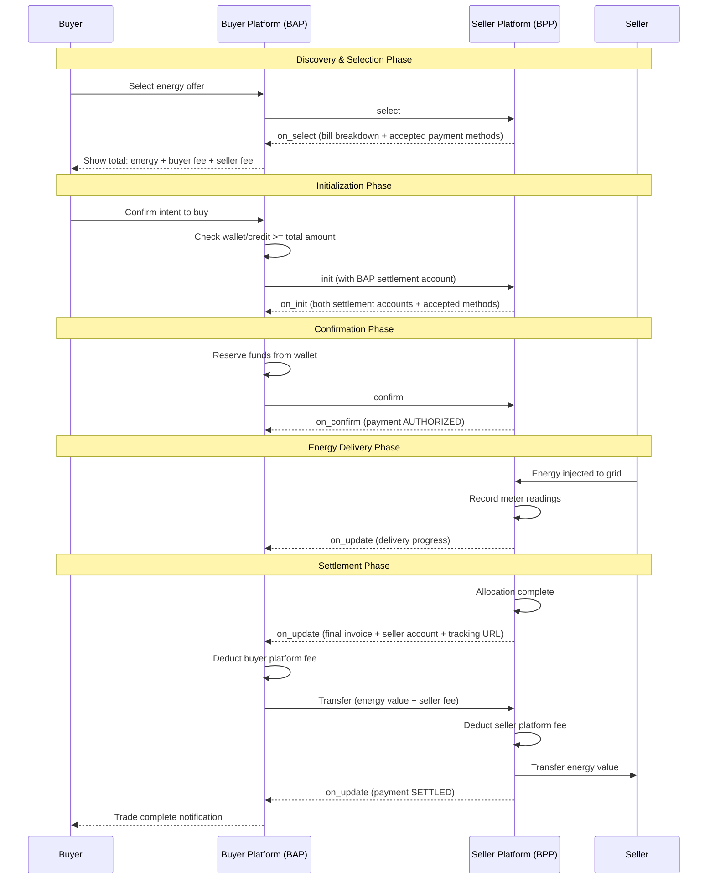

# Payment Design for P2P Energy Trading (Inter-Discom) <!-- omit from toc -->

Version 0.1 (Non-Normative)

## Table of contents <!-- omit from toc -->
- [1. Overview](#1-overview)
- [2. Design Principles](#2-design-principles)
  - [2.1. Peer-to-Peer Transparency](#21-peer-to-peer-transparency)
  - [2.2. Bill Component Transparency](#22-bill-component-transparency)
  - [2.3. Settlement Flow](#23-settlement-flow)
- [3. Sequence Diagram](#3-sequence-diagram)
- [4. Payment Status Lifecycle](#4-payment-status-lifecycle)
- [5. Bill Components](#5-bill-components)
- [6. Message Flow Examples](#6-message-flow-examples)
  - [6.1. on\_select: Bill Breakdown + Accepted Payment Methods](#61-on_select-bill-breakdown--accepted-payment-methods)
  - [6.2. on\_init: Payment Terms Confirmation](#62-on_init-payment-terms-confirmation)
  - [6.3. confirm: Payment Authorization](#63-confirm-payment-authorization)
  - [6.4. on\_update: Final Invoice (After Allocation)](#64-on_update-final-invoice-after-allocation)
  - [6.5. on\_update: Partial Delivery (Curtailment)](#65-on_update-partial-delivery-curtailment)
  - [6.6. on\_update: Settlement Complete](#66-on_update-settlement-complete)
  - [6.7. on\_status: Trade Completed](#67-on_status-trade-completed)
- [7. Key Design Decisions](#7-key-design-decisions)
  - [7.1. Why Platform-to-Platform Settlement?](#71-why-platform-to-platform-settlement)
  - [7.2. Customer Agency](#72-customer-agency)
  - [7.3. Discom's Role](#73-discoms-role)
- [8. Implementation Notes](#8-implementation-notes)
  - [8.1. For Buyer Platforms (BAP)](#81-for-buyer-platforms-bap)
  - [8.2. For Seller Platforms (BPP)](#82-for-seller-platforms-bpp)

## 1. Overview

This note documents the payment flow design for peer-to-peer energy trading across distribution companies (discoms). While trading platforms act as intermediaries facilitating transactions, the fundamental nature remains **peer-to-peer**: energy flows from one prosumer to another consumer, and payment should reflect this direct relationship.

## 2. Design Principles

### 2.1. Peer-to-Peer Transparency

Even though payments flow through platforms (BAP → BPP), the underlying transaction is between two individuals:
- **Seller (Prosumer)**: Generates excess energy and sells it
- **Buyer (Consumer)**: Purchases energy from the seller

Platforms act with **delegated agency** on behalf of their customers. This means:
- Customers must have **full visibility** into all transaction components
- All fees (both buyer and seller platform fees) must be disclosed upfront
- Customers retain the **right to pay sellers directly** in future implementations

### 2.2. Bill Component Transparency

At the selection stage (`on_select`), buyers must see the complete cost breakdown:
- **Energy value**: The actual cost of energy (quantity × price per unit)
- **Buyer platform fee**: Fee charged by the buyer's platform
- **Seller platform fee**: Fee charged by the seller's platform

This ensures informed consent before the trade is confirmed.

### 2.3. Settlement Flow

The payment settlement follows a clear progression:
1. **Authorization**: Buyer platform verifies wallet balance or credit line covers total amount
2. **Allocation**: After energy delivery is confirmed via meter readings
3. **Final Invoice**: Seller platform raises invoice with receiving account details
4. **Settlement**: Money moves from buyer platform to seller platform, then to seller

## 3. Sequence Diagram



## 4. Payment Status Lifecycle

| Status | When | Meaning |
|--------|------|---------|
| `PENDING` | on_select | Awaiting buyer decision |
| `INITIATED` | init | Payment process started |
| `AUTHORIZED` | on_init → on_confirm | Funds reserved, trade approved |
| `ADJUSTED` | on_update (curtailment) | Amount changed due to partial delivery |
| `SETTLED` | on_update (complete) | Money transferred to all parties |

## 5. Bill Components

The `beckn:orderValue` object provides full transparency:

```json
{
  "currency": "USD",
  "value": 4.25,
  "components": [
    {
      "type": "UNIT",
      "value": 4.05,
      "description": "Energy value (15 kWh × $0.15 + 10 kWh × $0.18)"
    },
    {
      "type": "FEE",
      "value": 0.08,
      "description": "Buyer platform fee (2%)"
    },
    {
      "type": "FEE",
      "value": 0.12,
      "description": "Seller platform fee (3%)"
    }
  ]
}
```

## 6. Message Flow Examples

### 6.1. on_select: Bill Breakdown + Accepted Payment Methods

At selection, the seller platform returns the complete bill breakdown and accepted payment methods, enabling the buyer to make an informed decision.

<details>
<summary><a href="../../../../examples/p2p-trading-interdiscom/v2/select-response.json">on_select Response</a></summary>

```json
{
  "context": {
    "version": "2.0.0",
    "action": "on_select",
    "timestamp": "2024-10-04T10:15:05Z",
    "message_id": "msg-on-select-001",
    "transaction_id": "txn-energy-001",
    "bap_id": "bap.energy-consumer.com",
    "bap_uri": "https://bap.energy-consumer.com",
    "bpp_id": "bpp.energy-provider.com",
    "bpp_uri": "https://bpp.energy-provider.com",
    "ttl": "PT30S",
    "domain": "beckn.one:deg:p2p-trading-interdiscom:2.0.0"
  },
  "message": {
    "order": {
      "@context": "https://raw.githubusercontent.com/beckn/protocol-specifications-new/refs/heads/main/schema/core/v2/context.jsonld",
      "@type": "beckn:Order",
      "beckn:orderStatus": "CREATED",
      "beckn:seller": "provider-solar-farm-001",
      "beckn:buyer": {
        "@context": "https://raw.githubusercontent.com/beckn/protocol-specifications-new/refs/heads/main/schema/core/v2/context.jsonld",
        "@type": "beckn:Buyer",
        "beckn:id": "buyer-001",
        "beckn:buyerAttributes": {
          "@context": "https://raw.githubusercontent.com/beckn/protocol-specifications-v2/refs/heads/p2p-trading/schema/EnergyTrade/v0.3/context.jsonld",
          "@type": "EnergyCustomer",
          "meterId": "der://meter/98765456",
          "utilityCustomerId": "BESCOM-CUST-001",
          "utilityId": "BESCOM-KA"
        }
      },
      "beckn:orderAttributes": {
        "@context": "https://raw.githubusercontent.com/beckn/protocol-specifications-v2/refs/heads/p2p-trading/schema/EnergyTrade/v0.3/context.jsonld",
        "@type": "EnergyTradeOrder",
        "bap_id": "bap.energy-consumer.com",
        "bpp_id": "bpp.energy-provider.com",
        "total_quantity": {
          "unitQuantity": 25.0,
          "unitText": "kWh"
        }
      },
      "beckn:orderValue": {
        "currency": "USD",
        "value": 4.25,
        "components": [
          {
            "type": "UNIT",
            "value": 4.05,
            "currency": "USD",
            "description": "Energy value (15 kWh × $0.15 + 10 kWh × $0.18)"
          },
          {
            "type": "FEE",
            "value": 0.08,
            "currency": "USD",
            "description": "Buyer platform fee (2%)"
          },
          {
            "type": "FEE",
            "value": 0.12,
            "currency": "USD",
            "description": "Seller platform fee (3%)"
          }
        ]
      },
      "beckn:payment": {
        "@context": "https://raw.githubusercontent.com/beckn/protocol-specifications-new/refs/heads/main/schema/core/v2/context.jsonld",
        "@type": "beckn:Payment",
        "beckn:paymentStatus": "PENDING",
        "beckn:acceptedPaymentMethod": ["UPI", "BANK_TRANSFER", "WALLET"]
      },
      "beckn:orderItems": [
        {
          "beckn:orderedItem": "energy-resource-solar-001",
          "beckn:orderItemAttributes": {
            "@context": "https://raw.githubusercontent.com/beckn/protocol-specifications-v2/refs/heads/p2p-trading/schema/EnergyTrade/v0.3/context.jsonld",
            "@type": "EnergyOrderItem",
            "providerAttributes": {
              "@context": "https://raw.githubusercontent.com/beckn/protocol-specifications-v2/refs/heads/p2p-trading/schema/EnergyTrade/v0.3/context.jsonld",
              "@type": "EnergyCustomer",
              "meterId": "der://meter/98765456",
              "utilityCustomerId": "BESCOM-CUST-001",
              "utilityId": "BESCOM-KA"
            }
          },
          "beckn:quantity": {
            "unitQuantity": 15.0,
            "unitText": "kWh"
          },
          "beckn:acceptedOffer": {
            "@context": "https://raw.githubusercontent.com/beckn/protocol-specifications-new/refs/heads/main/schema/core/v2/context.jsonld",
            "@type": "beckn:Offer",
            "beckn:id": "offer-morning-001",
            "beckn:descriptor": {
              "@type": "beckn:Descriptor",
              "schema:name": "Morning Solar Energy Offer"
            },
            "beckn:provider": "provider-solar-farm-001",
            "beckn:items": [
              "energy-resource-solar-001"
            ],
            "beckn:price": {
              "@type": "schema:PriceSpecification",
              "schema:price": 0.15,
              "schema:priceCurrency": "USD",
              "unitText": "kWh",
              "applicableQuantity": {
                "unitQuantity": 20.0,
                "unitText": "kWh"
              }
            },
            "beckn:offerAttributes": {
              "@context": "https://raw.githubusercontent.com/beckn/protocol-specifications-v2/refs/heads/p2p-trading/schema/EnergyTrade/v0.3/context.jsonld",
              "@type": "EnergyTradeOffer",
              "pricingModel": "PER_KWH",
              "deliveryWindow": {
                "@type": "beckn:TimePeriod",
                "schema:startTime": "2026-01-09T06:00:00Z",
                "schema:endTime": "2026-01-09T12:00:00Z"
              },
              "validityWindow": {
                "@type": "beckn:TimePeriod",
                "schema:startTime": "2026-01-09T00:00:00Z",
                "schema:endTime": "2026-01-09T05:00:00Z"
              }
            }
          }
        },
        {
          "beckn:orderedItem": "energy-resource-solar-001",
          "beckn:orderItemAttributes": {
            "@context": "https://raw.githubusercontent.com/beckn/protocol-specifications-v2/refs/heads/p2p-trading/schema/EnergyTrade/v0.3/context.jsonld",
            "@type": "EnergyOrderItem",
            "providerAttributes": {
              "@context": "https://raw.githubusercontent.com/beckn/protocol-specifications-v2/refs/heads/p2p-trading/schema/EnergyTrade/v0.3/context.jsonld",
              "@type": "EnergyCustomer",
              "meterId": "der://meter/98765456",
              "utilityCustomerId": "BESCOM-CUST-001",
              "utilityId": "BESCOM-KA"
            }
          },
          "beckn:quantity": {
            "unitQuantity": 10.0,
            "unitText": "kWh"
          },
          "beckn:acceptedOffer": {
            "@context": "https://raw.githubusercontent.com/beckn/protocol-specifications-new/refs/heads/main/schema/core/v2/context.jsonld",
            "@type": "beckn:Offer",
            "beckn:id": "offer-afternoon-001",
            "beckn:descriptor": {
              "@type": "beckn:Descriptor",
              "schema:name": "Afternoon Solar Energy Offer"
            },
            "beckn:provider": "provider-solar-farm-001",
            "beckn:items": [
              "energy-resource-solar-001"
            ],
            "beckn:price": {
              "@type": "schema:PriceSpecification",
              "schema:price": 0.18,
              "schema:priceCurrency": "USD",
              "unitText": "kWh",
              "applicableQuantity": {
                "unitQuantity": 15.0,
                "unitText": "kWh"
              }
            },
            "beckn:offerAttributes": {
              "@context": "https://raw.githubusercontent.com/beckn/protocol-specifications-v2/refs/heads/p2p-trading/schema/EnergyTrade/v0.3/context.jsonld",
              "@type": "EnergyTradeOffer",
              "pricingModel": "PER_KWH",
              "deliveryWindow": {
                "@type": "beckn:TimePeriod",
                "schema:startTime": "2026-01-09T12:00:00Z",
                "schema:endTime": "2026-01-09T18:00:00Z"
              },
              "validityWindow": {
                "@type": "beckn:TimePeriod",
                "schema:startTime": "2026-01-09T00:00:00Z",
                "schema:endTime": "2026-01-09T11:00:00Z"
              }
            }
          }
        }
      ]
    }
  }
}

```
</details>

### 6.2. on_init: Payment Terms Confirmation

The initialization response confirms both settlement accounts and accepted payment methods.

<details>
<summary><a href="../../../../examples/p2p-trading-interdiscom/v2/init-response.json">on_init Response</a></summary>

```json
{
  "context": {
    "version": "2.0.0",
    "action": "on_init",
    "timestamp": "2024-10-04T10:20:05Z",
    "message_id": "msg-on-init-001",
    "transaction_id": "txn-energy-001",
    "bap_id": "bap.energy-consumer.com",
    "bap_uri": "https://bap.energy-consumer.com",
    "bpp_id": "bpp.energy-provider.com",
    "bpp_uri": "https://bpp.energy-provider.com",
    "ttl": "PT30S",
    "domain": "beckn.one:deg:p2p-trading-interdiscom:2.0.0"
  },
  "message": {
    "order": {
      "@context": "https://raw.githubusercontent.com/beckn/protocol-specifications-new/refs/heads/main/schema/core/v2/context.jsonld",
      "@type": "beckn:Order",
      "beckn:orderStatus": "CREATED",
      "beckn:seller": "provider-solar-farm-001",
      "beckn:buyer": {
        "@context": "https://raw.githubusercontent.com/beckn/protocol-specifications-new/refs/heads/main/schema/core/v2/context.jsonld",
        "@type": "beckn:Buyer",
        "beckn:id": "buyer-001",
        "beckn:buyerAttributes": {
          "@context": "https://raw.githubusercontent.com/beckn/protocol-specifications-v2/refs/heads/p2p-trading/schema/EnergyTrade/v0.3/context.jsonld",
          "@type": "EnergyCustomer",
          "meterId": "der://meter/98765456",
          "utilityCustomerId": "BESCOM-CUST-001",
          "utilityId": "BESCOM-KA"
        }
      },
      "beckn:orderAttributes": {
        "@context": "https://raw.githubusercontent.com/beckn/protocol-specifications-v2/refs/heads/p2p-trading/schema/EnergyTrade/v0.3/context.jsonld",
        "@type": "EnergyTradeOrder",
        "bap_id": "bap.energy-consumer.com",
        "bpp_id": "bpp.energy-provider.com",
        "total_quantity": {
          "unitQuantity": 25.0,
          "unitText": "kWh"
        }
      },
      "beckn:orderItems": [
        {
          "beckn:orderedItem": "energy-resource-solar-001",
          "beckn:quantity": {
            "unitQuantity": 15.0,
            "unitText": "kWh"
          },
          "beckn:orderItemAttributes": {
            "@context": "https://raw.githubusercontent.com/beckn/protocol-specifications-v2/refs/heads/p2p-trading/schema/EnergyTrade/v0.3/context.jsonld",
            "@type": "EnergyOrderItem",
            "providerAttributes": {
              "@context": "https://raw.githubusercontent.com/beckn/protocol-specifications-v2/refs/heads/p2p-trading/schema/EnergyTrade/v0.3/context.jsonld",
              "@type": "EnergyCustomer",
              "meterId": "der://meter/98765456",
              "utilityCustomerId": "BESCOM-CUST-001",
              "utilityId": "BESCOM-KA"
            }
          },
          "beckn:acceptedOffer": {
            "@context": "https://raw.githubusercontent.com/beckn/protocol-specifications-new/refs/heads/main/schema/core/v2/context.jsonld",
            "@type": "beckn:Offer",
            "beckn:id": "offer-morning-001",
            "beckn:descriptor": {
              "@type": "beckn:Descriptor",
              "schema:name": "Morning Solar Energy Offer"
            },
            "beckn:provider": "provider-solar-farm-001",
            "beckn:items": [
              "energy-resource-solar-001"
            ],
            "beckn:price": {
              "@type": "schema:PriceSpecification",
              "schema:price": 0.15,
              "schema:priceCurrency": "USD",
              "unitText": "kWh",
              "applicableQuantity": {
                "unitQuantity": 20.0,
                "unitText": "kWh"
              }
            },
            "beckn:offerAttributes": {
              "@context": "https://raw.githubusercontent.com/beckn/protocol-specifications-v2/refs/heads/p2p-trading/schema/EnergyTrade/v0.3/context.jsonld",
              "@type": "EnergyTradeOffer",
              "pricingModel": "PER_KWH",
              "deliveryWindow": {
                "@type": "beckn:TimePeriod",
                "schema:startTime": "2026-01-09T06:00:00Z",
                "schema:endTime": "2026-01-09T12:00:00Z"
              },
              "validityWindow": {
                "@type": "beckn:TimePeriod",
                "schema:startTime": "2026-01-09T00:00:00Z",
                "schema:endTime": "2026-01-09T05:00:00Z"
              }
            }
          }
        },
        {
          "beckn:orderedItem": "energy-resource-solar-001",
          "beckn:quantity": {
            "unitQuantity": 10.0,
            "unitText": "kWh"
          },
          "beckn:orderItemAttributes": {
            "@context": "https://raw.githubusercontent.com/beckn/protocol-specifications-v2/refs/heads/p2p-trading/schema/EnergyTrade/v0.3/context.jsonld",
            "@type": "EnergyOrderItem",
            "providerAttributes": {
              "@context": "https://raw.githubusercontent.com/beckn/protocol-specifications-v2/refs/heads/p2p-trading/schema/EnergyTrade/v0.3/context.jsonld",
              "@type": "EnergyCustomer",
              "meterId": "der://meter/98765456",
              "utilityCustomerId": "BESCOM-CUST-001",
              "utilityId": "BESCOM-KA"
            }
          },
          "beckn:acceptedOffer": {
            "@context": "https://raw.githubusercontent.com/beckn/protocol-specifications-new/refs/heads/main/schema/core/v2/context.jsonld",
            "@type": "beckn:Offer",
            "beckn:id": "offer-afternoon-001",
            "beckn:descriptor": {
              "@type": "beckn:Descriptor",
              "schema:name": "Afternoon Solar Energy Offer"
            },
            "beckn:provider": "provider-solar-farm-001",
            "beckn:items": [
              "energy-resource-solar-001"
            ],
            "beckn:price": {
              "@type": "schema:PriceSpecification",
              "schema:price": 0.18,
              "schema:priceCurrency": "USD",
              "unitText": "kWh",
              "applicableQuantity": {
                "unitQuantity": 15.0,
                "unitText": "kWh"
              }
            },
            "beckn:offerAttributes": {
              "@context": "https://raw.githubusercontent.com/beckn/protocol-specifications-v2/refs/heads/p2p-trading/schema/EnergyTrade/v0.3/context.jsonld",
              "@type": "EnergyTradeOffer",
              "pricingModel": "PER_KWH",
              "deliveryWindow": {
                "@type": "beckn:TimePeriod",
                "schema:startTime": "2026-01-09T12:00:00Z",
                "schema:endTime": "2026-01-09T18:00:00Z"
              },
              "validityWindow": {
                "@type": "beckn:TimePeriod",
                "schema:startTime": "2026-01-09T00:00:00Z",
                "schema:endTime": "2026-01-09T11:00:00Z"
              }
            }
          }
        }
      ],
      "beckn:orderValue": {
        "currency": "USD",
        "value": 4.25,
        "components": [
          {
            "type": "UNIT",
            "value": 4.05,
            "currency": "USD",
            "description": "Energy value (15 kWh × $0.15 + 10 kWh × $0.18)"
          },
          {
            "type": "FEE",
            "value": 0.08,
            "currency": "USD",
            "description": "Buyer platform fee (2%)"
          },
          {
            "type": "FEE",
            "value": 0.12,
            "currency": "USD",
            "description": "Seller platform fee (3%)"
          }
        ]
      },
      "beckn:fulfillment": {
        "@context": "https://raw.githubusercontent.com/beckn/protocol-specifications-new/refs/heads/main/schema/core/v2/context.jsonld",
        "@type": "beckn:Fulfillment",
        "beckn:id": "fulfillment-energy-001",
        "beckn:mode": "DELIVERY"
      },
      "beckn:payment": {
        "@context": "https://raw.githubusercontent.com/beckn/protocol-specifications-new/refs/heads/main/schema/core/v2/context.jsonld",
        "@type": "beckn:Payment",
        "beckn:id": "payment-p2p-energy-001",
        "beckn:amount": {
          "currency": "USD",
          "value": 4.25
        },
        "beckn:acceptedPaymentMethod": ["UPI", "BANK_TRANSFER", "WALLET"],
        "beckn:beneficiary": "BPP",
        "beckn:paymentStatus": "AUTHORIZED",
        "beckn:paymentAttributes": {
          "@context": "https://raw.githubusercontent.com/beckn/protocol-specifications-new/refs/heads/main/schema/PaymentSettlement/v1/context.jsonld",
          "@type": "PaymentSettlement",
          "settlementAccounts": [
            {
              "beneficiaryId": "bap.energy-consumer.com",
              "accountHolderName": "Energy Consumer BAP Pvt Ltd",
              "accountNumber": "1234567890",
              "ifscCode": "HDFC0001234",
              "bankName": "HDFC Bank",
              "vpa": "energy-consumer@upi"
            },
            {
              "beneficiaryId": "bpp.energy-provider.com",
              "accountHolderName": "Solar Farm Energy Provider Pvt Ltd",
              "accountNumber": "9876543210",
              "ifscCode": "ICICI0005678",
              "bankName": "ICICI Bank",
              "vpa": "solar-provider@upi"
            }
          ]
        }
      }
    }
  }
}

```
</details>

### 6.3. confirm: Payment Authorization

The confirmation request contains minimal payment info - just the authorized amount. Full settlement details were already exchanged.

<details>
<summary><a href="../../../../examples/p2p-trading-interdiscom/v2/confirm-request.json">confirm Request</a></summary>

```json
{
  "context": {
    "version": "2.0.0",
    "action": "confirm",
    "timestamp": "2024-10-04T10:25:00Z",
    "message_id": "msg-confirm-001",
    "transaction_id": "txn-energy-001",
    "bap_id": "bap.energy-consumer.com",
    "bap_uri": "https://bap.energy-consumer.com",
    "bpp_id": "bpp.energy-provider.com",
    "bpp_uri": "https://bpp.energy-provider.com",
    "ttl": "PT30S",
    "domain": "beckn.one:deg:p2p-trading-interdiscom:2.0.0"
  },
  "message": {
    "order": {
      "@context": "https://raw.githubusercontent.com/beckn/protocol-specifications-new/refs/heads/main/schema/core/v2/context.jsonld",
      "@type": "beckn:Order",
      "beckn:orderStatus": "CREATED",
      "beckn:seller": "provider-solar-farm-001",
      "beckn:buyer": {
        "@context": "https://raw.githubusercontent.com/beckn/protocol-specifications-new/refs/heads/main/schema/core/v2/context.jsonld",
        "@type": "beckn:Buyer",
        "beckn:id": "buyer-001",
        "beckn:buyerAttributes": {
          "@context": "https://raw.githubusercontent.com/beckn/protocol-specifications-v2/refs/heads/p2p-trading/schema/EnergyTrade/v0.3/context.jsonld",
          "@type": "EnergyCustomer",
          "meterId": "der://meter/98765456",
          "utilityCustomerId": "BESCOM-CUST-001",
          "utilityId": "BESCOM-KA"
        }
      },
      "beckn:orderAttributes": {
        "@context": "https://raw.githubusercontent.com/beckn/protocol-specifications-v2/refs/heads/p2p-trading/schema/EnergyTrade/v0.3/context.jsonld",
        "@type": "EnergyTradeOrder",
        "bap_id": "bap.energy-consumer.com",
        "bpp_id": "bpp.energy-provider.com",
        "total_quantity": {
          "unitQuantity": 25.0,
          "unitText": "kWh"
        }
      },
      "beckn:orderItems": [
        {
          "beckn:orderedItem": "energy-resource-solar-001",
          "beckn:orderItemAttributes": {
            "@context": "https://raw.githubusercontent.com/beckn/protocol-specifications-v2/refs/heads/p2p-trading/schema/EnergyTrade/v0.3/context.jsonld",
            "@type": "EnergyOrderItem",
            "providerAttributes": {
              "@context": "https://raw.githubusercontent.com/beckn/protocol-specifications-v2/refs/heads/p2p-trading/schema/EnergyTrade/v0.3/context.jsonld",
              "@type": "EnergyCustomer",
              "meterId": "der://meter/98765456",
              "utilityCustomerId": "BESCOM-CUST-001",
              "utilityId": "BESCOM-KA"
            }
          },
          "beckn:quantity": {
            "unitQuantity": 15.0,
            "unitText": "kWh"
          },
          "beckn:acceptedOffer": {
            "@context": "https://raw.githubusercontent.com/beckn/protocol-specifications-new/refs/heads/main/schema/core/v2/context.jsonld",
            "@type": "beckn:Offer",
            "beckn:id": "offer-morning-001",
            "beckn:descriptor": {
              "@type": "beckn:Descriptor",
              "schema:name": "Morning Solar Energy Offer"
            },
            "beckn:provider": "provider-solar-farm-001",
            "beckn:items": [
              "energy-resource-solar-001"
            ],
            "beckn:price": {
              "@type": "schema:PriceSpecification",
              "schema:price": 0.15,
              "schema:priceCurrency": "USD",
              "unitText": "kWh",
              "applicableQuantity": {
                "unitQuantity": 20.0,
                "unitText": "kWh"
              }
            },
            "beckn:offerAttributes": {
              "@context": "https://raw.githubusercontent.com/beckn/protocol-specifications-v2/refs/heads/p2p-trading/schema/EnergyTrade/v0.3/context.jsonld",
              "@type": "EnergyTradeOffer",
              "pricingModel": "PER_KWH",
              "deliveryWindow": {
                "@type": "beckn:TimePeriod",
                "schema:startTime": "2026-01-09T06:00:00Z",
                "schema:endTime": "2026-01-09T12:00:00Z"
              },
              "validityWindow": {
                "@type": "beckn:TimePeriod",
                "schema:startTime": "2026-01-09T00:00:00Z",
                "schema:endTime": "2026-01-09T05:00:00Z"
              }
            }
          }
        },
        {
          "beckn:orderedItem": "energy-resource-solar-001",
          "beckn:orderItemAttributes": {
            "@context": "https://raw.githubusercontent.com/beckn/protocol-specifications-v2/refs/heads/p2p-trading/schema/EnergyTrade/v0.3/context.jsonld",
            "@type": "EnergyOrderItem",
            "providerAttributes": {
              "@context": "https://raw.githubusercontent.com/beckn/protocol-specifications-v2/refs/heads/p2p-trading/schema/EnergyTrade/v0.3/context.jsonld",
              "@type": "EnergyCustomer",
              "meterId": "der://meter/98765456",
              "utilityCustomerId": "BESCOM-CUST-001",
              "utilityId": "BESCOM-KA"
            }
          },
          "beckn:quantity": {
            "unitQuantity": 10.0,
            "unitText": "kWh"
          },
          "beckn:acceptedOffer": {
            "@context": "https://raw.githubusercontent.com/beckn/protocol-specifications-new/refs/heads/main/schema/core/v2/context.jsonld",
            "@type": "beckn:Offer",
            "beckn:id": "offer-afternoon-001",
            "beckn:descriptor": {
              "@type": "beckn:Descriptor",
              "schema:name": "Afternoon Solar Energy Offer"
            },
            "beckn:provider": "provider-solar-farm-001",
            "beckn:items": [
              "energy-resource-solar-001"
            ],
            "beckn:price": {
              "@type": "schema:PriceSpecification",
              "schema:price": 0.18,
              "schema:priceCurrency": "USD",
              "unitText": "kWh",
              "applicableQuantity": {
                "unitQuantity": 15.0,
                "unitText": "kWh"
              }
            },
            "beckn:offerAttributes": {
              "@context": "https://raw.githubusercontent.com/beckn/protocol-specifications-v2/refs/heads/p2p-trading/schema/EnergyTrade/v0.3/context.jsonld",
              "@type": "EnergyTradeOffer",
              "pricingModel": "PER_KWH",
              "deliveryWindow": {
                "@type": "beckn:TimePeriod",
                "schema:startTime": "2026-01-09T12:00:00Z",
                "schema:endTime": "2026-01-09T18:00:00Z"
              },
              "validityWindow": {
                "@type": "beckn:TimePeriod",
                "schema:startTime": "2026-01-09T00:00:00Z",
                "schema:endTime": "2026-01-09T11:00:00Z"
              }
            }
          }
        }
      ],
      "beckn:fulfillment": {
        "@context": "https://raw.githubusercontent.com/beckn/protocol-specifications-new/refs/heads/main/schema/core/v2/context.jsonld",
        "@type": "beckn:Fulfillment",
        "beckn:id": "fulfillment-energy-001",
        "beckn:mode": "DELIVERY"
      },
      "beckn:payment": {
        "@context": "https://raw.githubusercontent.com/beckn/protocol-specifications-new/refs/heads/main/schema/core/v2/context.jsonld",
        "@type": "beckn:Payment",
        "beckn:id": "payment-p2p-energy-001",
        "beckn:amount": {
          "currency": "USD",
          "value": 4.25
        },
        "beckn:beneficiary": "BPP",
        "beckn:paymentStatus": "AUTHORIZED"
      }
    }
  }
}

```
</details>

### 6.4. on_update: Final Invoice (After Allocation)

After energy allocation is complete, the seller platform raises the final invoice with:
- Final amounts based on actual delivered quantities
- Seller's settlement account for payment
- Payment tracking URL for transparency

<details>
<summary><a href="../../../../examples/p2p-trading-interdiscom/v2/on-update-response-final-invoice.json">on_update Final Invoice</a></summary>

```json
{
  "context": {
    "version": "2.0.0",
    "action": "on_update",
    "timestamp": "2024-10-04T18:15:00Z",
    "message_id": "msg-on-update-final-invoice-001",
    "transaction_id": "txn-energy-001",
    "bap_id": "bap.energy-consumer.com",
    "bap_uri": "https://bap.energy-consumer.com",
    "bpp_id": "bpp.energy-provider.com",
    "bpp_uri": "https://bpp.energy-provider.com",
    "ttl": "PT30S",
    "domain": "beckn.one:deg:p2p-trading-interdiscom:2.0.0"
  },
  "message": {
    "order": {
      "@context": "https://raw.githubusercontent.com/beckn/protocol-specifications-new/refs/heads/main/schema/core/v2/context.jsonld",
      "@type": "beckn:Order",
      "beckn:id": "order-energy-001",
      "beckn:orderStatus": "INPROGRESS",
      "beckn:seller": "provider-solar-farm-001",
      "beckn:buyer": {
        "@context": "https://raw.githubusercontent.com/beckn/protocol-specifications-new/refs/heads/main/schema/core/v2/context.jsonld",
        "@type": "beckn:Buyer",
        "beckn:id": "buyer-001",
        "beckn:buyerAttributes": {
          "@context": "https://raw.githubusercontent.com/beckn/protocol-specifications-v2/refs/heads/p2p-trading/schema/EnergyTrade/v0.3/context.jsonld",
          "@type": "EnergyCustomer",
          "meterId": "der://meter/98765456",
          "utilityCustomerId": "BESCOM-CUST-001",
          "utilityId": "BESCOM-KA"
        }
      },
      "beckn:orderItems": [
        {
          "beckn:orderedItem": "energy-resource-solar-001",
          "beckn:quantity": {
            "unitQuantity": 15.0,
            "unitText": "kWh"
          },
          "beckn:orderItemAttributes": {
            "@context": "https://raw.githubusercontent.com/beckn/protocol-specifications-v2/refs/heads/p2p-trading/schema/EnergyTrade/v0.3/context.jsonld",
            "@type": "EnergyOrderItem",
            "providerAttributes": {
              "@context": "https://raw.githubusercontent.com/beckn/protocol-specifications-v2/refs/heads/p2p-trading/schema/EnergyTrade/v0.3/context.jsonld",
              "@type": "EnergyCustomer",
              "meterId": "der://meter/98765456",
              "utilityCustomerId": "BESCOM-CUST-001",
              "utilityId": "BESCOM-KA"
            },
            "fulfillmentAttributes": {
              "@context": "https://raw.githubusercontent.com/beckn/protocol-specifications-v2/refs/heads/p2p-trading/schema/EnergyTrade/v0.3/context.jsonld",
              "@type": "EnergyTradeDelivery",
              "deliveryStatus": "COMPLETED",
              "deliveryMode": "GRID_INJECTION",
              "deliveredQuantity": 15.0,
              "meterReadings": [
                {
                  "beckn:timeWindow": {
                    "@type": "beckn:TimePeriod",
                    "schema:startTime": "2024-10-04T06:00:00Z",
                    "schema:endTime": "2024-10-04T12:00:00Z"
                  },
                  "consumedEnergy": 0.0,
                  "producedEnergy": 15.0,
                  "allocatedEnergy": 15.0,
                  "unit": "kWh"
                }
              ],
              "lastUpdated": "2024-10-04T18:00:00Z"
            }
          },
          "beckn:acceptedOffer": {
            "@context": "https://raw.githubusercontent.com/beckn/protocol-specifications-new/refs/heads/main/schema/core/v2/context.jsonld",
            "@type": "beckn:Offer",
            "beckn:id": "offer-morning-001",
            "beckn:descriptor": {
              "@type": "beckn:Descriptor",
              "schema:name": "Morning Solar Energy Offer"
            },
            "beckn:provider": "provider-solar-farm-001",
            "beckn:items": [
              "energy-resource-solar-001"
            ],
            "beckn:price": {
              "@type": "schema:PriceSpecification",
              "schema:price": 0.15,
              "schema:priceCurrency": "USD",
              "unitText": "kWh",
              "applicableQuantity": {
                "unitQuantity": 20.0,
                "unitText": "kWh"
              }
            },
            "beckn:offerAttributes": {
              "@context": "https://raw.githubusercontent.com/beckn/protocol-specifications-v2/refs/heads/p2p-trading/schema/EnergyTrade/v0.3/context.jsonld",
              "@type": "EnergyTradeOffer",
              "pricingModel": "PER_KWH",
              "deliveryWindow": {
                "@type": "beckn:TimePeriod",
                "schema:startTime": "2026-01-09T06:00:00Z",
                "schema:endTime": "2026-01-09T12:00:00Z"
              },
              "validityWindow": {
                "@type": "beckn:TimePeriod",
                "schema:startTime": "2026-01-09T00:00:00Z",
                "schema:endTime": "2026-01-09T05:00:00Z"
              }
            }
          }
        },
        {
          "beckn:orderedItem": "energy-resource-solar-001",
          "beckn:quantity": {
            "unitQuantity": 10.0,
            "unitText": "kWh"
          },
          "beckn:orderItemAttributes": {
            "@context": "https://raw.githubusercontent.com/beckn/protocol-specifications-v2/refs/heads/p2p-trading/schema/EnergyTrade/v0.3/context.jsonld",
            "@type": "EnergyOrderItem",
            "providerAttributes": {
              "@context": "https://raw.githubusercontent.com/beckn/protocol-specifications-v2/refs/heads/p2p-trading/schema/EnergyTrade/v0.3/context.jsonld",
              "@type": "EnergyCustomer",
              "meterId": "der://meter/98765456",
              "utilityCustomerId": "BESCOM-CUST-001",
              "utilityId": "BESCOM-KA"
            },
            "fulfillmentAttributes": {
              "@context": "https://raw.githubusercontent.com/beckn/protocol-specifications-v2/refs/heads/p2p-trading/schema/EnergyTrade/v0.3/context.jsonld",
              "@type": "EnergyTradeDelivery",
              "deliveryStatus": "COMPLETED",
              "deliveryMode": "GRID_INJECTION",
              "deliveredQuantity": 10.0,
              "meterReadings": [
                {
                  "beckn:timeWindow": {
                    "@type": "beckn:TimePeriod",
                    "schema:startTime": "2024-10-04T12:00:00Z",
                    "schema:endTime": "2024-10-04T18:00:00Z"
                  },
                  "consumedEnergy": 0.0,
                  "producedEnergy": 10.0,
                  "allocatedEnergy": 10.0,
                  "unit": "kWh"
                }
              ],
              "lastUpdated": "2024-10-04T18:00:00Z"
            }
          },
          "beckn:acceptedOffer": {
            "@context": "https://raw.githubusercontent.com/beckn/protocol-specifications-new/refs/heads/main/schema/core/v2/context.jsonld",
            "@type": "beckn:Offer",
            "beckn:id": "offer-afternoon-001",
            "beckn:descriptor": {
              "@type": "beckn:Descriptor",
              "schema:name": "Afternoon Solar Energy Offer"
            },
            "beckn:provider": "provider-solar-farm-001",
            "beckn:items": [
              "energy-resource-solar-001"
            ],
            "beckn:price": {
              "@type": "schema:PriceSpecification",
              "schema:price": 0.18,
              "schema:priceCurrency": "USD",
              "unitText": "kWh",
              "applicableQuantity": {
                "unitQuantity": 15.0,
                "unitText": "kWh"
              }
            },
            "beckn:offerAttributes": {
              "@context": "https://raw.githubusercontent.com/beckn/protocol-specifications-v2/refs/heads/p2p-trading/schema/EnergyTrade/v0.3/context.jsonld",
              "@type": "EnergyTradeOffer",
              "pricingModel": "PER_KWH",
              "deliveryWindow": {
                "@type": "beckn:TimePeriod",
                "schema:startTime": "2026-01-09T12:00:00Z",
                "schema:endTime": "2026-01-09T18:00:00Z"
              },
              "validityWindow": {
                "@type": "beckn:TimePeriod",
                "schema:startTime": "2026-01-09T00:00:00Z",
                "schema:endTime": "2026-01-09T11:00:00Z"
              }
            }
          }
        }
      ],
      "beckn:orderValue": {
        "currency": "USD",
        "value": 4.25,
        "components": [
          {
            "type": "UNIT",
            "value": 4.05,
            "currency": "USD",
            "description": "Energy value (15 kWh × $0.15 + 10 kWh × $0.18)"
          },
          {
            "type": "FEE",
            "value": 0.08,
            "currency": "USD",
            "description": "Buyer platform fee (2%)"
          },
          {
            "type": "FEE",
            "value": 0.12,
            "currency": "USD",
            "description": "Seller platform fee (3%)"
          }
        ]
      },
      "beckn:payment": {
        "@context": "https://raw.githubusercontent.com/beckn/protocol-specifications-new/refs/heads/main/schema/core/v2/context.jsonld",
        "@type": "beckn:Payment",
        "beckn:id": "payment-p2p-energy-001",
        "beckn:amount": {
          "currency": "USD",
          "value": 4.25
        },
        "beckn:beneficiary": "BPP",
        "beckn:paymentStatus": "AUTHORIZED",
        "beckn:acceptedPaymentMethod": ["UPI", "BANK_TRANSFER"],
        "beckn:paymentURL": "https://payments.seller-platform.com/track?txn=TXN-ENERGY-001",
        "beckn:paymentAttributes": {
          "@context": "https://raw.githubusercontent.com/beckn/protocol-specifications-new/refs/heads/main/schema/PaymentSettlement/v1/context.jsonld",
          "@type": "PaymentSettlement",
          "settlementAccounts": [
            {
              "beneficiaryId": "bpp.energy-provider.com",
              "accountHolderName": "Solar Farm Energy Provider Pvt Ltd",
              "accountNumber": "9876543210",
              "ifscCode": "ICICI0005678",
              "bankName": "ICICI Bank",
              "vpa": "solar-provider@upi"
            }
          ]
        }
      }
    }
  }
}

```
</details>

### 6.5. on_update: Partial Delivery (Curtailment)

If delivery is curtailed (e.g., grid outage), the payment amount is adjusted to reflect actual delivered energy.

<details>
<summary><a href="../../../../examples/p2p-trading-interdiscom/v2/on-update-response-curtailment.json">on_update Curtailment</a></summary>

```json
{
  "context": {
    "version": "2.0.0",
    "action": "on_update",
    "timestamp": "2024-10-04T14:30:00Z",
    "message_id": "msg-on-update-curtailment-001",
    "transaction_id": "txn-energy-001",
    "bap_id": "bap.energy-consumer.com",
    "bap_uri": "https://bap.energy-consumer.com",
    "bpp_id": "bpp.energy-provider.com",
    "bpp_uri": "https://bpp.energy-provider.com",
    "ttl": "PT30S",
    "domain": "beckn.one:deg:p2p-trading-interdiscom:2.0.0"
  },
  "message": {
    "order": {
      "@context": "https://raw.githubusercontent.com/beckn/protocol-specifications-new/refs/heads/main/schema/core/v2/context.jsonld",
      "@type": "beckn:Order",
      "beckn:id": "order-energy-001",
      "beckn:orderStatus": "INPROGRESS",
      "beckn:seller": "provider-solar-farm-001",
      "beckn:buyer": {
        "@context": "https://raw.githubusercontent.com/beckn/protocol-specifications-new/refs/heads/main/schema/core/v2/context.jsonld",
        "@type": "beckn:Buyer",
        "beckn:id": "buyer-001",
        "beckn:buyerAttributes": {
          "@context": "https://raw.githubusercontent.com/beckn/protocol-specifications-v2/refs/heads/p2p-trading/schema/EnergyTrade/v0.3/context.jsonld",
          "@type": "EnergyCustomer",
          "meterId": "der://meter/98765456",
          "utilityCustomerId": "BESCOM-CUST-001",
          "utilityId": "BESCOM-KA"
        }
      },
      "beckn:orderItems": [
        {
          "beckn:orderedItem": "energy-resource-solar-001",
          "beckn:quantity": {
            "unitQuantity": 15.0,
            "unitText": "kWh"
          },
          "beckn:orderItemAttributes": {
            "@context": "https://raw.githubusercontent.com/beckn/protocol-specifications-v2/refs/heads/p2p-trading/schema/EnergyTrade/v0.3/context.jsonld",
            "@type": "EnergyOrderItem",
            "providerAttributes": {
              "@context": "https://raw.githubusercontent.com/beckn/protocol-specifications-v2/refs/heads/p2p-trading/schema/EnergyTrade/v0.3/context.jsonld",
              "@type": "EnergyCustomer",
              "meterId": "der://meter/98765456",
              "utilityCustomerId": "BESCOM-CUST-001",
              "utilityId": "BESCOM-KA"
            },
            "fulfillmentAttributes": {
              "@context": "https://raw.githubusercontent.com/beckn/protocol-specifications-v2/refs/heads/p2p-trading/schema/EnergyTrade/v0.3/context.jsonld",
              "@type": "EnergyTradeDelivery",
              "deliveryStatus": "IN_PROGRESS",
              "deliveryMode": "GRID_INJECTION",
              "deliveredQuantity": 8.5,
              "curtailedQuantity": 6.5,
              "curtailmentReason": "GRID_OUTAGE",
              "meterReadings": [
                {
                  "beckn:timeWindow": {
                    "@type": "beckn:TimePeriod",
                    "schema:startTime": "2024-10-04T06:00:00Z",
                    "schema:endTime": "2024-10-04T12:00:00Z"
                  },
                  "consumedEnergy": 0.0,
                  "producedEnergy": 8.5,
                  "allocatedEnergy": 8.5,
                  "unit": "kWh"
                }
              ],
              "lastUpdated": "2024-10-04T14:30:00Z"
            }
          },
          "beckn:acceptedOffer": {
            "@context": "https://raw.githubusercontent.com/beckn/protocol-specifications-new/refs/heads/main/schema/core/v2/context.jsonld",
            "@type": "beckn:Offer",
            "beckn:id": "offer-morning-001",
            "beckn:descriptor": {
              "@type": "beckn:Descriptor",
              "schema:name": "Morning Solar Energy Offer"
            },
            "beckn:provider": "provider-solar-farm-001",
            "beckn:items": [
              "energy-resource-solar-001"
            ],
            "beckn:price": {
              "@type": "schema:PriceSpecification",
              "schema:price": 0.15,
              "schema:priceCurrency": "USD",
              "unitText": "kWh",
              "applicableQuantity": {
                "unitQuantity": 20.0,
                "unitText": "kWh"
              }
            },
            "beckn:offerAttributes": {
              "@context": "https://raw.githubusercontent.com/beckn/protocol-specifications-v2/refs/heads/p2p-trading/schema/EnergyTrade/v0.3/context.jsonld",
              "@type": "EnergyTradeOffer",
              "pricingModel": "PER_KWH",
              "deliveryWindow": {
                "@type": "beckn:TimePeriod",
                "schema:startTime": "2026-01-09T06:00:00Z",
                "schema:endTime": "2026-01-09T12:00:00Z"
              },
              "validityWindow": {
                "@type": "beckn:TimePeriod",
                "schema:startTime": "2026-01-09T00:00:00Z",
                "schema:endTime": "2026-01-09T05:00:00Z"
              }
            }
          }
        }
      ],
      "beckn:orderValue": {
        "currency": "USD",
        "value": 1.36,
        "components": [
          {
            "type": "UNIT",
            "value": 1.28,
            "currency": "USD",
            "description": "Energy value for delivered quantity (8.5 kWh × $0.15)"
          },
          {
            "type": "FEE",
            "value": 0.03,
            "currency": "USD",
            "description": "Buyer platform fee (2%)"
          },
          {
            "type": "FEE",
            "value": 0.04,
            "currency": "USD",
            "description": "Seller platform fee (3%)"
          }
        ]
      },
      "beckn:payment": {
        "@context": "https://raw.githubusercontent.com/beckn/protocol-specifications-new/refs/heads/main/schema/core/v2/context.jsonld",
        "@type": "beckn:Payment",
        "beckn:id": "payment-p2p-energy-001",
        "beckn:amount": {
          "currency": "USD",
          "value": 1.36
        },
        "beckn:beneficiary": "BPP",
        "beckn:paymentStatus": "ADJUSTED"
      }
    }
  }
}

```
</details>

### 6.6. on_update: Settlement Complete

Once money has moved from buyer platform to seller platform (tracked via URL), the seller platform marks the trade complete.

<details>
<summary><a href="../../../../examples/p2p-trading-interdiscom/v2/on-update-response-settlement-complete.json">on_update Settlement Complete</a></summary>

```json
{
  "context": {
    "version": "2.0.0",
    "action": "on_update",
    "timestamp": "2024-10-04T18:45:00Z",
    "message_id": "msg-on-update-settlement-complete-001",
    "transaction_id": "txn-energy-001",
    "bap_id": "bap.energy-consumer.com",
    "bap_uri": "https://bap.energy-consumer.com",
    "bpp_id": "bpp.energy-provider.com",
    "bpp_uri": "https://bpp.energy-provider.com",
    "ttl": "PT30S",
    "domain": "beckn.one:deg:p2p-trading-interdiscom:2.0.0"
  },
  "message": {
    "order": {
      "@context": "https://raw.githubusercontent.com/beckn/protocol-specifications-new/refs/heads/main/schema/core/v2/context.jsonld",
      "@type": "beckn:Order",
      "beckn:id": "order-energy-001",
      "beckn:orderStatus": "COMPLETED",
      "beckn:seller": "provider-solar-farm-001",
      "beckn:buyer": {
        "@context": "https://raw.githubusercontent.com/beckn/protocol-specifications-new/refs/heads/main/schema/core/v2/context.jsonld",
        "@type": "beckn:Buyer",
        "beckn:id": "buyer-001",
        "beckn:buyerAttributes": {
          "@context": "https://raw.githubusercontent.com/beckn/protocol-specifications-v2/refs/heads/p2p-trading/schema/EnergyTrade/v0.3/context.jsonld",
          "@type": "EnergyCustomer",
          "meterId": "der://meter/98765456",
          "utilityCustomerId": "BESCOM-CUST-001",
          "utilityId": "BESCOM-KA"
        }
      },
      "beckn:orderItems": [
        {
          "beckn:orderedItem": "energy-resource-solar-001",
          "beckn:quantity": {
            "unitQuantity": 15.0,
            "unitText": "kWh"
          },
          "beckn:acceptedOffer": {
            "@context": "https://raw.githubusercontent.com/beckn/protocol-specifications-new/refs/heads/main/schema/core/v2/context.jsonld",
            "@type": "beckn:Offer",
            "beckn:id": "offer-morning-001",
            "beckn:descriptor": {
              "@type": "beckn:Descriptor",
              "schema:name": "Morning Solar Energy Offer"
            },
            "beckn:provider": "provider-solar-farm-001",
            "beckn:items": ["energy-resource-solar-001"]
          }
        },
        {
          "beckn:orderedItem": "energy-resource-solar-001",
          "beckn:quantity": {
            "unitQuantity": 10.0,
            "unitText": "kWh"
          },
          "beckn:acceptedOffer": {
            "@context": "https://raw.githubusercontent.com/beckn/protocol-specifications-new/refs/heads/main/schema/core/v2/context.jsonld",
            "@type": "beckn:Offer",
            "beckn:id": "offer-afternoon-001",
            "beckn:descriptor": {
              "@type": "beckn:Descriptor",
              "schema:name": "Afternoon Solar Energy Offer"
            },
            "beckn:provider": "provider-solar-farm-001",
            "beckn:items": ["energy-resource-solar-001"]
          }
        }
      ],
      "beckn:orderValue": {
        "currency": "USD",
        "value": 4.25,
        "components": [
          {
            "type": "UNIT",
            "value": 4.05,
            "currency": "USD",
            "description": "Energy value (15 kWh × $0.15 + 10 kWh × $0.18)"
          },
          {
            "type": "FEE",
            "value": 0.08,
            "currency": "USD",
            "description": "Buyer platform fee (2%)"
          },
          {
            "type": "FEE",
            "value": 0.12,
            "currency": "USD",
            "description": "Seller platform fee (3%)"
          }
        ]
      },
      "beckn:payment": {
        "@context": "https://raw.githubusercontent.com/beckn/protocol-specifications-new/refs/heads/main/schema/core/v2/context.jsonld",
        "@type": "beckn:Payment",
        "beckn:id": "payment-p2p-energy-001",
        "beckn:amount": {
          "currency": "USD",
          "value": 4.25
        },
        "beckn:beneficiary": "BPP",
        "beckn:paymentStatus": "SETTLED",
        "beckn:paidAt": "2024-10-04T18:40:00Z",
        "beckn:txnRef": "TXN-ENERGY-001-SETTLED"
      }
    }
  }
}

```
</details>

### 6.7. on_status: Trade Completed

Final status shows the order and payment as complete.

<details>
<summary><a href="../../../../examples/p2p-trading-interdiscom/v2/status-response-completed.json">on_status Completed</a></summary>

```json
{
  "context": {
    "version": "2.0.0",
    "action": "on_status",
    "timestamp": "2024-10-04T18:30:00Z",
    "message_id": "msg-on-status-completed-001",
    "transaction_id": "txn-energy-001",
    "bap_id": "bap.energy-consumer.com",
    "bap_uri": "https://bap.energy-consumer.com",
    "bpp_id": "bpp.energy-provider.com",
    "bpp_uri": "https://bpp.energy-provider.com",
    "ttl": "PT30S",
    "domain": "beckn.one:deg:p2p-trading-interdiscom:2.0.0"
  },
  "message": {
    "order": {
      "@context": "https://raw.githubusercontent.com/beckn/protocol-specifications-new/refs/heads/main/schema/core/v2/context.jsonld",
      "@type": "beckn:Order",
      "beckn:id": "order-energy-001",
      "beckn:orderStatus": "COMPLETED",
      "beckn:seller": "provider-solar-farm-001",
      "beckn:buyer": {
        "@context": "https://raw.githubusercontent.com/beckn/protocol-specifications-new/refs/heads/main/schema/core/v2/context.jsonld",
        "@type": "beckn:Buyer",
        "beckn:id": "buyer-001",
        "beckn:buyerAttributes": {
          "@context": "https://raw.githubusercontent.com/beckn/protocol-specifications-v2/refs/heads/p2p-trading/schema/EnergyTrade/v0.3/context.jsonld",
          "@type": "EnergyCustomer",
          "meterId": "der://meter/98765456",
          "utilityCustomerId": "BESCOM-CUST-001",
          "utilityId": "BESCOM-KA"
        }
      },
      "beckn:orderItems": [
        {
          "beckn:orderedItem": "energy-resource-solar-001",
          "beckn:quantity": {
            "unitQuantity": 15.0,
            "unitText": "kWh"
          },
          "beckn:orderItemAttributes": {
            "@context": "https://raw.githubusercontent.com/beckn/protocol-specifications-v2/refs/heads/p2p-trading/schema/EnergyTrade/v0.3/context.jsonld",
            "@type": "EnergyOrderItem",
            "providerAttributes": {
              "@context": "https://raw.githubusercontent.com/beckn/protocol-specifications-v2/refs/heads/p2p-trading/schema/EnergyTrade/v0.3/context.jsonld",
              "@type": "EnergyCustomer",
              "meterId": "der://meter/98765456",
              "utilityCustomerId": "BESCOM-CUST-001",
              "utilityId": "BESCOM-KA"
            },
            "fulfillmentAttributes": {
              "@context": "https://raw.githubusercontent.com/beckn/protocol-specifications-v2/refs/heads/p2p-trading/schema/EnergyTrade/v0.3/context.jsonld",
              "@type": "EnergyTradeDelivery",
              "deliveryStatus": "COMPLETED",
              "deliveryMode": "GRID_INJECTION",
              "deliveredQuantity": 15.0,
              "meterReadings": [
                {
                  "beckn:timeWindow": {
                    "@type": "beckn:TimePeriod",
                    "schema:startTime": "2024-10-04T06:00:00Z",
                    "schema:endTime": "2024-10-04T09:00:00Z"
                  },
                  "consumedEnergy": 0.0,
                  "producedEnergy": 7.5,
                  "allocatedEnergy": 7.5,
                  "unit": "kWh"
                },
                {
                  "beckn:timeWindow": {
                    "@type": "beckn:TimePeriod",
                    "schema:startTime": "2024-10-04T09:00:00Z",
                    "schema:endTime": "2024-10-04T12:00:00Z"
                  },
                  "consumedEnergy": 0.0,
                  "producedEnergy": 7.5,
                  "allocatedEnergy": 7.5,
                  "unit": "kWh"
                }
              ],
              "lastUpdated": "2024-10-04T12:00:00Z"
            }
          },
          "beckn:acceptedOffer": {
            "@context": "https://raw.githubusercontent.com/beckn/protocol-specifications-new/refs/heads/main/schema/core/v2/context.jsonld",
            "@type": "beckn:Offer",
            "beckn:id": "offer-morning-001",
            "beckn:descriptor": {
              "@type": "beckn:Descriptor",
              "schema:name": "Morning Solar Energy Offer"
            },
            "beckn:provider": "provider-solar-farm-001",
            "beckn:items": [
              "energy-resource-solar-001"
            ],
            "beckn:price": {
              "@type": "schema:PriceSpecification",
              "schema:price": 0.15,
              "schema:priceCurrency": "USD",
              "unitText": "kWh",
              "applicableQuantity": {
                "unitQuantity": 20.0,
                "unitText": "kWh"
              }
            },
            "beckn:offerAttributes": {
              "@context": "https://raw.githubusercontent.com/beckn/protocol-specifications-v2/refs/heads/p2p-trading/schema/EnergyTrade/v0.3/context.jsonld",
              "@type": "EnergyTradeOffer",
              "pricingModel": "PER_KWH",
              "deliveryWindow": {
                "@type": "beckn:TimePeriod",
                "schema:startTime": "2026-01-09T06:00:00Z",
                "schema:endTime": "2026-01-09T12:00:00Z"
              },
              "validityWindow": {
                "@type": "beckn:TimePeriod",
                "schema:startTime": "2026-01-09T00:00:00Z",
                "schema:endTime": "2026-01-09T05:00:00Z"
              }
            }
          }
        },
        {
          "beckn:orderedItem": "energy-resource-solar-001",
          "beckn:quantity": {
            "unitQuantity": 10.0,
            "unitText": "kWh"
          },
          "beckn:orderItemAttributes": {
            "@context": "https://raw.githubusercontent.com/beckn/protocol-specifications-v2/refs/heads/p2p-trading/schema/EnergyTrade/v0.3/context.jsonld",
            "@type": "EnergyOrderItem",
            "providerAttributes": {
              "@context": "https://raw.githubusercontent.com/beckn/protocol-specifications-v2/refs/heads/p2p-trading/schema/EnergyTrade/v0.3/context.jsonld",
              "@type": "EnergyCustomer",
              "meterId": "der://meter/98765456",
              "utilityCustomerId": "BESCOM-CUST-001",
              "utilityId": "BESCOM-KA"
            },
            "fulfillmentAttributes": {
              "@context": "https://raw.githubusercontent.com/beckn/protocol-specifications-v2/refs/heads/p2p-trading/schema/EnergyTrade/v0.3/context.jsonld",
              "@type": "EnergyTradeDelivery",
              "deliveryStatus": "COMPLETED",
              "deliveryMode": "GRID_INJECTION",
              "deliveredQuantity": 10.0,
              "meterReadings": [
                {
                  "beckn:timeWindow": {
                    "@type": "beckn:TimePeriod",
                    "schema:startTime": "2024-10-04T12:00:00Z",
                    "schema:endTime": "2024-10-04T15:00:00Z"
                  },
                  "consumedEnergy": 0.0,
                  "producedEnergy": 5.0,
                  "allocatedEnergy": 5.0,
                  "unit": "kWh"
                },
                {
                  "beckn:timeWindow": {
                    "@type": "beckn:TimePeriod",
                    "schema:startTime": "2024-10-04T15:00:00Z",
                    "schema:endTime": "2024-10-04T18:00:00Z"
                  },
                  "consumedEnergy": 0.0,
                  "producedEnergy": 5.0,
                  "allocatedEnergy": 5.0,
                  "unit": "kWh"
                }
              ],
              "lastUpdated": "2024-10-04T18:00:00Z"
            }
          },
          "beckn:acceptedOffer": {
            "@context": "https://raw.githubusercontent.com/beckn/protocol-specifications-new/refs/heads/main/schema/core/v2/context.jsonld",
            "@type": "beckn:Offer",
            "beckn:id": "offer-afternoon-001",
            "beckn:descriptor": {
              "@type": "beckn:Descriptor",
              "schema:name": "Afternoon Solar Energy Offer"
            },
            "beckn:provider": "provider-solar-farm-001",
            "beckn:items": [
              "energy-resource-solar-001"
            ],
            "beckn:price": {
              "@type": "schema:PriceSpecification",
              "schema:price": 0.18,
              "schema:priceCurrency": "USD",
              "unitText": "kWh",
              "applicableQuantity": {
                "unitQuantity": 15.0,
                "unitText": "kWh"
              }
            },
            "beckn:offerAttributes": {
              "@context": "https://raw.githubusercontent.com/beckn/protocol-specifications-v2/refs/heads/p2p-trading/schema/EnergyTrade/v0.3/context.jsonld",
              "@type": "EnergyTradeOffer",
              "pricingModel": "PER_KWH",
              "deliveryWindow": {
                "@type": "beckn:TimePeriod",
                "schema:startTime": "2026-01-09T12:00:00Z",
                "schema:endTime": "2026-01-09T18:00:00Z"
              },
              "validityWindow": {
                "@type": "beckn:TimePeriod",
                "schema:startTime": "2026-01-09T00:00:00Z",
                "schema:endTime": "2026-01-09T11:00:00Z"
              }
            }
          }
        }
      ],
      "beckn:orderValue": {
        "currency": "USD",
        "value": 4.25,
        "components": [
          {
            "type": "UNIT",
            "value": 4.05,
            "currency": "USD",
            "description": "Energy value (15 kWh × $0.15 + 10 kWh × $0.18)"
          },
          {
            "type": "FEE",
            "value": 0.08,
            "currency": "USD",
            "description": "Buyer platform fee (2%)"
          },
          {
            "type": "FEE",
            "value": 0.12,
            "currency": "USD",
            "description": "Seller platform fee (3%)"
          }
        ]
      },
      "beckn:payment": {
        "@context": "https://raw.githubusercontent.com/beckn/protocol-specifications-new/refs/heads/main/schema/core/v2/context.jsonld",
        "@type": "beckn:Payment",
        "beckn:id": "payment-p2p-energy-001",
        "beckn:amount": {
          "currency": "USD",
          "value": 4.25
        },
        "beckn:beneficiary": "BPP",
        "beckn:paymentStatus": "SETTLED",
        "beckn:paidAt": "2024-10-04T19:00:00Z"
      }
    }
  }
}

```
</details>

## 7. Key Design Decisions

### 7.1. Why Platform-to-Platform Settlement?

While the trade is peer-to-peer, platform-to-platform settlement provides:
1. **Credit management**: Platforms can extend goodwill credit to customers
2. **Wallet management**: Customers can pre-fund wallets for faster trades
3. **Dispute resolution**: Platforms can mediate if issues arise
4. **Regulatory compliance**: Platforms handle KYC/AML requirements

### 7.2. Customer Agency

Despite platform intermediation:
- **Full visibility**: All fees and amounts are disclosed in every message
- **Settlement transparency**: Tracking URLs allow customers to verify fund movement
- **Future optionality**: The protocol supports direct peer-to-peer payment in future versions
- **Choice of platform**: Customers can choose platforms based on fees and services

### 7.3. Discom's Role

Discoms (distribution companies) are privy to:
- **Trade volumes only**: For grid management and wheeling fee calculation
- **Wheeling fees**: Charged separately in monthly utility bills
- **No double billing**: Peer-traded energy is excluded from regular consumption billing

## 8. Implementation Notes

### 8.1. For Buyer Platforms (BAP)

1. **Before confirm**: Verify `wallet_balance + goodwill_credit >= total_amount`
2. **On final invoice**: Validate bill components match original on_select
3. **Settlement**: Deduct buyer fee, transfer remainder to seller platform
4. **Tracking**: Monitor payment URL until SETTLED status received

### 8.2. For Seller Platforms (BPP)

1. **On select**: Return complete bill breakdown with all fees
2. **On init**: Provide settlement account details
3. **After allocation**: Raise final invoice with tracking URL
4. **On payment receipt**: Deduct seller fee, pay seller, send SETTLED status

---

*This design ensures that while platforms facilitate the transaction, customers remain the principals in a true peer-to-peer energy trade.*
