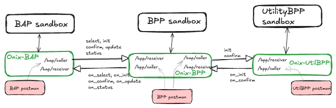
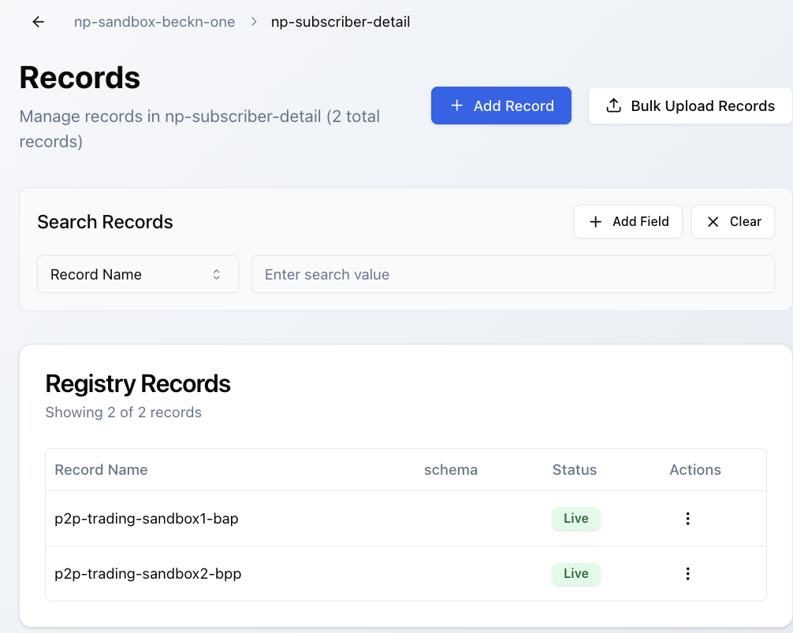
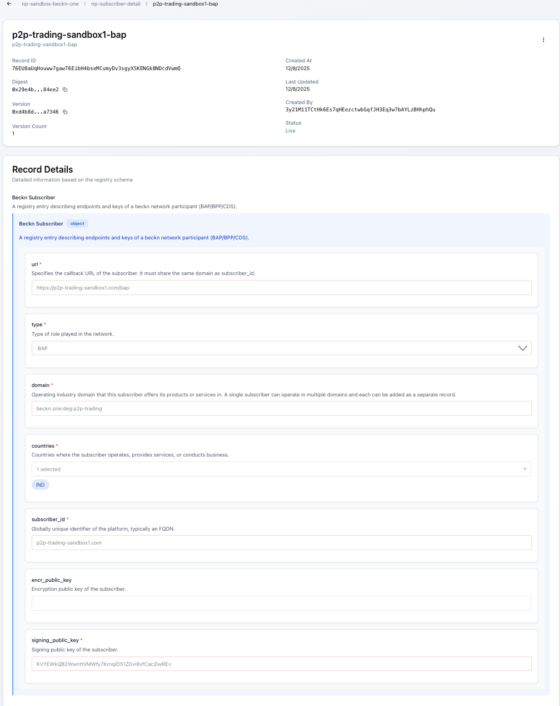
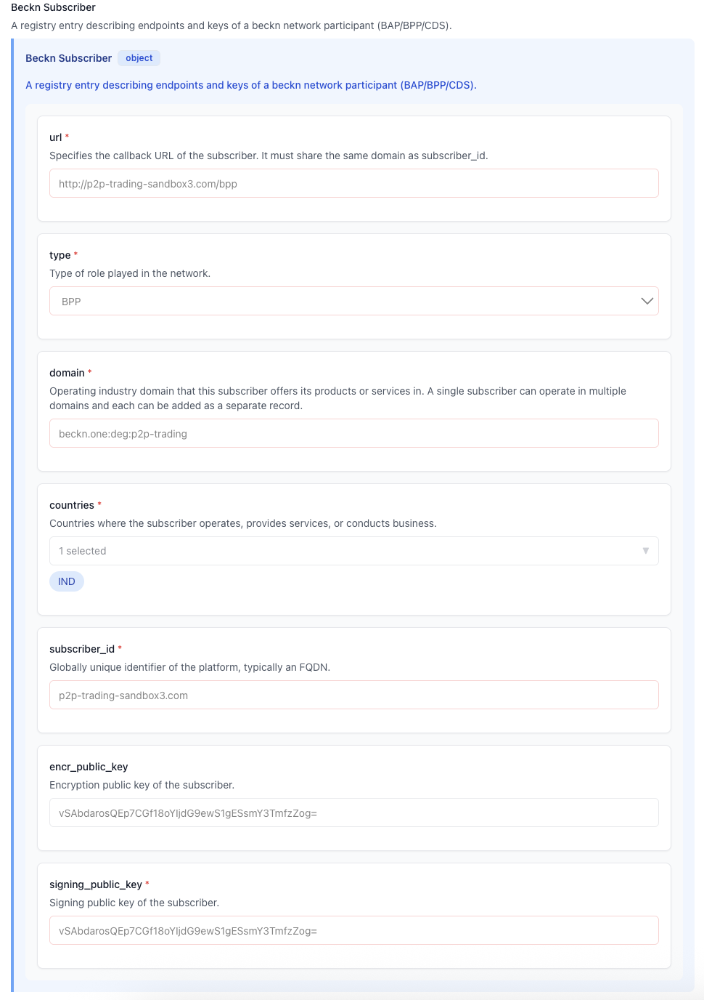

# P2P Energy Trading Devkit

Goal of this devkit is to enable a developer to test round trip Beckn v2.0 mock messages between all network actors (BAP, Prosumer BPP (called BPP for brevity), Utility BPP, see [implementation-guide](/docs/implementation-guides/v2/P2P_Trading/P2P_Trading_implementation_guide_DRAFT.md)), on their local machine within a few minutes.

It is a *batteries included* sandbox environment that requires minimal setup, and has environment variables pre-configured, connections to Catalog Discovery Service and Dedi test registry service pre-configured.

## Setup

1. Install [docker desktop](https://www.docker.com/products/docker-desktop) & run it in background.
2. Install [git](https://git-scm.com/downloads) ensure that git is added to your system path.
3. Install [postman](https://www.postman.com/downloads/)
4. Clone this repository using git command line interface and navigate to the install directory. (TODO: branch p2p-trading needs to be removed after merge to main from the following command)

```
git clone -b p2p-trading https://github.com/Beckn-One/DEG.git
cd DEG/testnet/p2p-energy-trading-devkit/install
```

### References used in this guide
- Beckn 2.0 sandbox [repo](https://github.com/beckn/sandbox), [image](https://hub.docker.com/r/fidedocker/sandbox-2.0).
- Beckn-Onix [repo](https://github.com/Beckn-One/beckn-onix), [image](https://hub.docker.com/r/fidedocker/onix-adapter).
- DeDi (decentralized directory, a Beckn-One service based open DeDi [protocol](https://github.com/finternet-io/dedi)) website [production](https://dedi.global/), [test](https://publish-test.dedi.global/). We use test DeDi server for this demo.
- Registry service (cache layer on top of DeDi, a Beckn-One service) [production](https://api.beckn.one/registry), [test](http://api.testnet.beckn.one/registry). We use test registry server for this demo.


## Test network

1. Spin up the containers using docker compose. Verify that the following containers are running: redis, onix-bap, onix-bpp, onix-utilitybpp, sandbox-bap, sandbox-bpp, sandbox-utilitybpp. You can also navigate to docker desktop and check the containers and their logs.
    ```
    docker compose -f ./docker-compose-adapter-p2p.yml up -d
    docker ps
    ```

2. Open postman and import the folder `DEG/testnet/p2p-energy-trading-devkit/postman` to import all the collections and environment variables.

3. Start by publishing a mock catalog to the catalog discovery service using the collection `P2P-Trading:CDSupload-DEG`.

4. Check if you can see this catalog via a BAP by using the collection `P2P-Trading:BAP-DEG/discover`. Note that this can be flaky and may timeout sometimes due to CDS unavailability. In that case try again.

5. Use the collection `P2P-Trading:BAP-DEG` (select, init, confirm, status queries) to test the round trip Beckn v2.0 mock messages between BAP and BPP. The query reponse will show an "Ack" message, and detailed `on_select`, `on_init`, `on_confirm`, `on_status` messages from BPP should be visible in the BAP logs.

6. Use the collection `P2P-Trading:BPP-DEG` (on_select, on_init, on_confirm, on_status) to test only the BPP to BAP trip Beckn v2.0 mock messages between BPP to BAP.

7. Use the collection `P2P-Trading:BPP-DEG` (cascaded_init) to test only the BPP to Utility BPP round trip Beckn v2.0 mock messages. The query reponse will show an "Ack" message, and detailed `on_init`, `on_confirm`, `on_status` messages from Utility BPP should be visible in the Prosumer BPP logs.

8. Use the collection `P2P-Trading:UtilityBPP-DEG` (cascaded_init) to test only the Utility BPP to prosumer BPP Beckn v2.0 mock messages. The query reponse will show an "Ack" message, and detailed `on_init`, `on_confirm`, `on_status` messages from Utility BPP should be visible in the Prosumer BPP logs.

9. Stop the containers using docker compose
    ```
    docker compose -f ./docker-compose-adapter-p2p.yml down
    ```

## Under the hood

1. BAP `discover` calls are routed to Catalog Discovery Service url `https://34.93.141.21.sslip.io/beckn` defined [here](./config/local-p2p-routing-BuyerBAPCaller.yaml)
2. Public keys from network participants are fetched from Beckn One registry service `http://api.testnet.beckn.one/registry/dedi` which acts as a cache layer on top of Dedi registry, and are used to confirm that Beckn messages are sent by the trusted actor (and not by an imposter). The namespace and registry entries in Dedi are preconfigured in yaml files within config folder. The process of creating a DiDi namespace and registries is defined [here](https://beckn-labs.gitbook.io/beckn-labs-docs/beckn-registry/publishing-subscriber-details) and also further down on this page. For testing, it is recommended to create records in Dedi registry which are then cached by Beckn One registry service every hour. The registry records such as `p2p-trading-sandbox1.com` (BAP), `p2p-trading-sandbox2.com` (BPP), `p2p-trading-sandbox3.com` (utility BPP) were added beforehand, and used in this devkit. An example API call during runtime to registry service looks like [this](https://api.testnet.beckn.one/registry/dedi/lookup/p2p-trading-sandbox1.com/subscribers.beckn.one/76EU8aUqHouww7gawT6EibH4bseMCumyDv3sgyXSKENGk8NDcdVwmQ).
3. Routing rules within each actor are defined in config for [BAP](./config/local-p2p-bap.yaml), [BPP](./config/local-p2p-bpp.yaml), [Utility BPP](./config/local-p2p-utilitybpp.yaml).
4. Network between various actors is defined in docker-compose-adapter-p2p.yml
5. Variables are preconfigured to following values.
    | Variable Name               | Value                                      | Notes                       |
    | :-------------------------- | :----------------------------------------- | :-------------------------- |
    | `domain`                    | `beckn.one:deg:p2p-trading:2.0.0`          |                             |
    | `version`                   | `2.0.0`                                    |                             |
    | `bap_id`                    | `p2p-trading-sandbox1.com`                 |                             |
    | `bap_uri`                   | `http://onix-bap:8081/bap/receiver`        |                             |
    | `bpp_id`                    | `p2p-trading-sandbox2.com`                 |                             |
    | `bpp_uri`                   | `http://onix-bpp:8082/bpp/receiver`        |                             |
    | `bpp_bapreceiver_uri`       | `http://onix-bpp:8082/bap/receiver`        |                             |
    | `utilitybpp_id`             | `p2p-trading-sandbox3.com`                 |                             |
    | `utilitybpp_uri`            | `http://onix-utilitybpp:8083/bpp/receiver` |                             |
    | `bap_adapter_url`           | `http://localhost:8081/bap/caller`         | BAP collection only         |
    | `bpp_adapter_url`           | `http://localhost:8082/bpp/caller`         | BPP collection only         |
    | `bpp_adapter_bapcaller_url` | `http://localhost:8082/bap/caller`         | BPP collection only         |
    | `utilitybpp_adapter_url`    | `http://localhost:8083/bpp/caller`         | Utility BPP collection only |
    | `transaction_id`            | `3769776b-88b4-469d-9ee2-95044fe5dafc`     |                             |
    | `iso_date`                  | `2025-01-01T10:00:00Z`                     |                             |
    | `cds_url`                   | `https://34.93.141.21.sslip.io`            | CDS Upload collection only  |

## Routing

<details>
<summary>P2P Routing Diagram</summary>



</details>

## Next steps towards a production network:

TBD

## Troubleshooting

- If one of your onix containers fails to start due to `failed to load SchemaValidator plugin` error, 
  you may have an older stale image of `fidedocker/onix-adapter` [here](https://hub.docker.com/r/fidedocker/onix-adapter).

## Setting up Dedi registry

A more complete documentation is located [here](https://beckn-labs.gitbook.io/beckn-labs-docs/beckn-registry/publishing-subscriber-details), which also includes a [video walk-through](https://www.loom.com/share/e0293309701348dc95719a98b957d12c?sid=04b8dc00-51de-46ac-82ce-adc1a0060409). Here are just the steps taken to create a dummy registry for this testnet.


- Registered in the DeDi [dev website](https://publish-test.dedi.global/) and created two
  unverified (verification happens when you own a fully qualified domain name, and can store a publicly viewable dedi verification file on it) namespaces. Namespaces should be one per atomic entity like an organization. Here it was created for utility and a network participant
  which is both a BAP & BPP. Ideally each network participant should claim their own namespace, add registries to it, create registry records within each registry (say for their BAP and BPP).
  
  <details>
  <summary>Test dedi namespaces</summary>
  
  
  
  </details>
- Registries created within namespace `np_subscriber_detail` are as follows.
  
  <details>
  <summary>Test network participant registries</summary>
  
  
  
  </details>
- A specific registry record created for a participant BAP looks like below. 
  Note that it asks for a various fields such as `url` which is the callback url of subscriber, `type` (BAP or BPP or BG or CDS), `countries`, `subscriber_id`, `domain = 'beckn.one:deg:p2p-trading'` (globally unique FQDN of platform) and `signing_public_key`. Public and private key pairs can be generated by the utility script located [here](https://github.com/Beckn-One/beckn-onix/blob/main/install/generate-ed25519-keys.go). e.g.  `go run generate-ed25519-keys.go `
  
  <details>
  <summary>BAP sandbox 1 registry record</summary>
  
  
  
  </details>
- Similar registry records are created for BPP
  
  <details>
  <summary>BPP sandbox 2 registry record</summary>
  
  
  
  </details>
- And another one for utility BPP.
  
  <details>
  <summary>Utility BPP sandbox 3 registry record</summary>
  
  
  
  </details>
- Within the beckn-onix configuration (`config/*.yaml` files) use the `networkParticipant` (`subscriber_id` from DeDi setup), `keyId` (Record ID from DeDi setup) along with the signing & encryption private and public keys.
- Finally enable caching of the DeDi registry  by registry service by completeing last step from [these instructions](https://beckn-labs.gitbook.io/beckn-labs-docs/beckn-registry/publishing-subscriber-details).

## Regenerating Postman Collection

To regenerate the Postman collections for this devkit:

```bash
python3 scripts/generate_postman_collection.py --devkit p2p-trading --role BAP --output-dir testnet/p2p-energy-trading-devkit/postman
python3 scripts/generate_postman_collection.py --devkit p2p-trading --role BPP --output-dir testnet/p2p-energy-trading-devkit/postman
python3 scripts/generate_postman_collection.py --devkit p2p-trading --role UtilityBPP --output-dir testnet/p2p-energy-trading-devkit/postman
```
